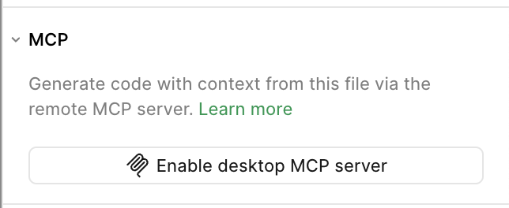

# Contribution Guide

Руководство по устройству репо и по тому, как вносить изменения: от нового компонента с нуля до миграции из старой дизайн-системы.

## Как устроен репозиторий

Это **pnpm monorepo**. Пакеты дизайн-системы публикуются из `packages/*`, приложения лежат в `apps/*`.

```
design-system/
├── packages/                      # Публикуемые npm-пакеты @ds/*
│   └── <pkg>/
│       ├── src/<Name>/            # nested-раскладка по компоненту
│       ├── stories/<Name>/        # Playground + VisualMatrix
│       ├── demos/                 # <Name>Demo.tsx для docs
│       ├── docs/                  # index.mdx + props.json
│       └── __test__/<Name>/       # Playwright specs + __snapshots__/
├── apps/
│   ├── storybook/                 # Storybook 10
│   └── docs/                      # Astro + Starlight
├── playwright/                    # Корневые fixtures, constants, utils
├── playwright.config.ts           # Сканирует packages/**/__test__/**/*.spec.ts
├── tests/docs/                    # Docs-only Playwright suite
├── tsconfig.base.json             # Единый источник общих compilerOptions
├── tsconfig.json                  # Typecheck-профиль (noEmit)
├── packages/tsconfig.esm.json     # Оркестратор ESM-сборки (project references)
├── packages/tsconfig.cjs.json     # Оркестратор CJS-сборки
├── scripts/
│   ├── add-package.mts            # Создаёт новый пакет и подключает его к репо
│   ├── add-package/               # scaffold.mts, wire.mts
│   ├── gen-props.mts              # docs/props.json из типов
│   └── gen-readme.mts             # README.md из MDX
└── .claude/                       # Rules / Skills / Commands для Claude Code
```

**Чем собирается и связывается репо:**

- `pnpm workspaces` — линкует пакеты между собой и с приложениями.
- Корневые скрипты (`package.json`) — сборка пакетов: `tspc` (ESM + CJS) → SCSS/CSS → постобработка CJS для CSS Modules.
- `lerna` — только для версий и публикации в npm (independent).

## Быстрый старт

```bash
pnpm deps
npx playwright install               # один раз, для E2E

pnpm dev:storybook                   # localhost:6006
pnpm dev:docs                        # localhost:4321
pnpm dev                             # оба параллельно
```

## Анатомия пакета

Реальная раскладка пакета — **nested по компоненту**, даже если компонент один. Подробности — в [`.claude/rules/package-src-structure.md`](https://git.sbercloud.tech/sbercloud-ui/tokens-design-system/variables/storybook/-/blob/master/.claude/rules/package-src-structure.md) и [`.claude/rules/reference-package-anatomy.md`](https://git.sbercloud.tech/sbercloud-ui/tokens-design-system/variables/storybook/-/blob/master/.claude/rules/reference-package-anatomy.md).

```
packages/<pkg>/
├── src/
│   ├── <Name>/
│   │   ├── <Name>.tsx
│   │   ├── constants.ts
│   │   ├── types.ts
│   │   ├── styles.module.scss
│   │   └── index.ts               # export * from './<Name>'
│   └── index.ts                   # export * по секциям
├── stories/
│   └── <Name>/
│       ├── <Name>.Playground.stories.tsx     # обязателен
│       ├── <Name>.VisualMatrix.stories.tsx   # обязателен
│       ├── testIds.ts                        # если id повторяются в 2+ местах
│       ├── examples/                         # появляется только если в ней есть story
│       │   └── <Name>.<Scenario>.stories.tsx # сценарии, копируемые потребителем
│       └── tests/                            # появляется только если в ней есть story
│           └── <Name>.<Scenario>.stories.tsx # InteractionTest и т.п. — только тест-обвязка
├── __test__/
│   └── <ParentComponent>/                    # одна папка на parent; сабкомпоненты — через args
│       ├── helpers.ts
│       ├── rendering.spec.ts                 # всегда
│       ├── visual.spec.ts                    # всегда
│       ├── interaction.spec.ts               # только при applicable browser-specific сценариях
│       ├── keyboard.spec.ts                  # только при applicable kbd-сценариях
│       ├── polymorphism.spec.ts              # если есть `as`
│       └── __snapshots__/                    # baseline PNG (chrome-only)
├── demos/
│   ├── <Name>Demo.tsx
│   └── examples/<Example>.tsx                # для MDX через ?raw
├── docs/
│   ├── index.mdx
│   └── props.json                            # автоген: pnpm gen:props
├── package.json
├── tsconfig.json
├── tsconfig.esm.json
├── tsconfig.cjs.json
└── README.md                                 # автоген: pnpm gen:readme
```

### Зачем нужны `demos/`

Папка `demos/` — это **источник живых примеров для документационного портала**, а не дубль stories.

- `demos/<Name>Demo.tsx` — Canvas-плейграунд для секции `## Демо` в MDX (только для props-driven компонентов без центральных колбеков; см. [`.claude/rules/docs-structure.md`](https://git.sbercloud.tech/sbercloud-ui/tokens-design-system/variables/storybook/-/blob/master/.claude/rules/docs-structure.md)).
- `demos/examples/<Example>.tsx` — самостоятельные React-компоненты для блоков `<Example>` в MDX. Каждый файл импортируется и как живой компонент (через `client:visible`), и как исходник через `?raw` — читатель видит работающий пример **и** код, который можно скопировать целиком, включая `import`-строки.

Stories vs demos: stories живут в Storybook (визуальная регрессия + play-тесты), demos живут в docs-портале (объяснение API на живых сценариях, ориентированных на потребителя). Один и тот же компонент в обеих ролях не переиспользуется — у них разные требования к state и к отображению кода.

Multi-component пакеты (`@ds/button`: `Button` + `ButtonGroup`) повторяют эту раскладку **для каждого публичного компонента**: `src/Button/`, `src/ButtonGroup/`, `stories/Button/`, `stories/ButtonGroup/`, `__test__/Button/`, `__test__/ButtonGroup/`.

### Зависимости пакета

- Только **строгие версии** (`"classnames": "2.5.1"`, не `^2.5.1`).
- Повторяющиеся внешние зависимости (`react`, `react-dom`, `@types/react*`, `classnames`, `sass`, `typescript`, `lodash.debounce`, `merge-refs`, `uncontrollable`) подключаются через **`catalog:`** — версия живёт в `pnpm-workspace.yaml::catalog`.
- В пакете **нет** `react` / `react-dom` / `@types/react*` — ни в одном блоке. Корень workspace'а поставляет React для сборки и тестов.
- Внутренние зависимости — `workspace:*`.

Правило: [`.claude/rules/packages-deps.md`](https://git.sbercloud.tech/sbercloud-ui/tokens-design-system/variables/storybook/-/blob/master/.claude/rules/packages-deps.md).

### package.json — exports

```json
{
  "name": "@ds/button",
  "exports": {
    ".": {
      "source": "./src/index.ts",
      "types": "./dist/esm/index.d.ts",
      "import": "./dist/esm/index.js",
      "require": "./dist/cjs/index.js"
    }
  }
}
```

`source` читают Storybook и docs в dev-режиме. CSS живёт как side-effect в самих JS-бандлах (SCSS-модули) — потребителю отдельным импортом подключать ничего не нужно.

## Как работают стили

`styles.module.scss` + токены `@sbercloud/figma-variables`:

```scss
@use '@sbercloud/figma-variables/build/scss/styles/styles.module' as base;

.button {
  background: base.$sn-theme-color-primary-accent;
}
```

CSS Modules — `camelCaseOnly` (`styles.primaryButton`, не `styles['primary-button']`). SCSS компилируется рядом с JS в `dist/esm` и `dist/cjs`; для CJS применяется `babel-plugin-react-css-modules`.

## Storybook (версия 10)

Storybook автоматически подхватывает `packages/*/stories/**/*.stories.tsx` — ручной регистрации нет.

```bash
pnpm dev:storybook
```

### CSF3 — формат stories

Все stories пишем в **CSF3** (Component Story Format 3) — текущий формат Storybook 7+. Каждая story — объект `StoryObj<typeof Component>` с полями `args`, `play`, `tags`. Старый CSF2 (функциональные stories `() => <Button />` с присваиванием `Story.args = {}`) **не используется** — он не даёт строгой типизации `args` и хуже работает с Test Runner.

Документация:

- [CSF API reference](https://storybook.js.org/docs/api/csf)
- [Storybook CSF3 is here](https://storybook.js.org/blog/storybook-csf3-is-here/)

### Структура stories — Playground + VisualMatrix

Полные правила: [`.claude/rules/stories-standard.md`](https://git.sbercloud.tech/sbercloud-ui/tokens-design-system/variables/storybook/-/blob/master/.claude/rules/stories-standard.md). Каждый компонент получает минимум **два** файла.

```tsx
// packages/<pkg>/stories/<Name>/<Name>.Playground.stories.tsx
import { Meta, StoryObj } from '@storybook/react';
import { expect, within } from 'storybook/test';
import { APPEARANCE, Button, SIZE } from '@ds/button';

const meta: Meta<typeof Button> = {
  title: 'Components/Button',
  component: Button,
  parameters: { layout: 'centered' },
  args: {
    label: 'Button',
    appearance: APPEARANCE.Primary,
    size: SIZE.M,
    'data-test-id': 'button',
  },
  argTypes: {
    appearance: { control: 'radio', options: Object.values(APPEARANCE) },
    size: { control: 'select', options: Object.values(SIZE) },
  },
};
export default meta;
type Story = StoryObj<typeof Button>;

export const Playground: Story = {
  tags: ['dev', 'test'],
  play: async ({ canvasElement }) => {
    await expect(within(canvasElement).getByTestId('button')).toBeVisible();
  },
};
```

```tsx
// packages/<pkg>/stories/<Name>/<Name>.VisualMatrix.stories.tsx
import { StoryTable } from '#storybook/components';
// ...
```

Ключевые требования:

- CSF3, `Meta<typeof Component>` + `StoryObj<typeof Component>`.
- Импорты play-утилит — из `storybook/test` (subpath ядра `storybook@10`), **не** из `@storybook/test`.
- Каждая story имеет `data-test-id` в `args` (kebab-case от имени компонента).
- В `play` — только `getByTestId`. `getByRole`/`getByText`/`getByLabelText` запрещены.
- VisualMatrix строится на `StoryTable` из `#storybook/components`.
- **Запрещены файлы**: «на одну ось» (`Sizes`, `Appearances`, `Views`, `Variants`, `LoadingState`, `DisabledState`, `EmptyState`, `WithIcon`/`IconOnly`/`WithCounter` если это просто включение слота), `ClickTest`/`KeyboardTest` (объединяются в `InteractionTest`).
- **Запрещены**: тег `autodocs`, тег `fixture`, `parameters.docs.description.*`, дубль одной story между `examples/` и `tests/`, висящий `/Tests` или `/Examples` в title без имени сценария.
- Повторяющиеся `data-test-id` выносятся в `stories/<Name>/testIds.ts` (single-component) или `stories/testIds.ts` (multi-component) **единым объектом** `TEST_IDS` со вложенной структурой по компонентам/слотам. Россыпь отдельных `<NAME>_TEST_ID` const'ов не заводится. Если компонент сам ставит `data-test-id` на свои внутренние слоты — эти строки публикуются через `TEST_IDS` в `src/constants.ts` (часть публичного API пакета).

### Подпапки `examples/` и `tests/`

Доп. story всегда живёт в подпапке `stories/<Name>/examples/` либо `stories/<Name>/tests/`. Корень `stories/<Name>/` содержит **только** Playground/VisualMatrix. Куда положить — решается механическим критерием **копируемости**:

- **`examples/<Name>.<Scenario>.stories.tsx`** — если фрагмент копируется потребителем в продакшн-код как самостоятельный, работающий снаружи теста (composition, slot-пресет, polymorphism с `as={Link}`, controlled-режим, реальный react state). Title — `Components/<…>/<Name>/Examples/<Scenario>`.
- **`tests/<Name>.<Scenario>.stories.tsx`** — если фрагмент содержит `fn()`-моки, контролируемые stub-state, edge-state или последовательность действий, важную только для assertion'а; вне теста смысла не имеет. Title — `Components/<…>/<Name>/Tests/<Scenario>`. Один интеракционный сценарий — один экспорт `InteractionTest` (клик + клавиатура + фокус через `step()`).

Каждая дополнительная story обязана проходить **«Критерий обоснованности артефакта»** из [`.claude/rules/complexity-tiers.md`](https://git.sbercloud.tech/sbercloud-ui/tokens-design-system/variables/storybook/-/blob/master/.claude/rules/complexity-tiers.md) (3 условия: проверяет что-то новое из публичной поверхности, не выражается через `args`/StoryTable/play, не дублирует другой слой). При переезде story между корнем и подпапкой обязательно обновить story IDs в `packages/<pkg>/__test__/<Name>/helpers.ts` — иначе e2e получит 404.

### Trigger-based компоненты

Modal, drawer, popover, dropdown, tooltip, toaster и любые dialog-like / portal-компоненты следуют отдельному правилу [`.claude/rules/trigger-based-stories.md`](https://git.sbercloud.tech/sbercloud-ui/tokens-design-system/variables/storybook/-/blob/master/.claude/rules/trigger-based-stories.md): `open` не выводится в args (живёт в локальном `useState` render-компонента), триггер — `Button` из `@ds/button` с `data-test-id={TEST_IDS.triggerOpen}`, `parameters.layout: 'fullscreen'`, конфликты значений между осями разрешаются runtime + `<DemoWarning>`, а не через `if:`.

## Документационный портал

Портал (`apps/docs/`) собирается на Astro и автоподтягивает MDX из двух источников:

| Источник                               | URL                            |
| -------------------------------------- | ------------------------------ |
| `packages/*/docs/*.mdx`                | `/components/<pkg>/<filename>` |
| `apps/docs/src/content/patterns/*.mdx` | `/patterns/<filename>`         |

### Доменная группировка пакетов

Главная страница и сайдбар группируют пакеты по **префиксу имени**. Конфиг — [`apps/docs/src/config/domains.ts`](https://git.sbercloud.tech/sbercloud-ui/tokens-design-system/variables/storybook/-/blob/master/apps/docs/src/config/domains.ts):

| Префикс пакета    | Домен в портале и Storybook |
| ----------------- | --------------------------- |
| `uikit-product-*` | Uikit Product               |
| `ai-*`            | AI                          |
| `admin-*`         | Admin                       |
| (остальное)       | Components                  |

Резолвер `resolveDomain(pkg)` идёт по списку `DOMAINS` сверху вниз, первое попадание по `prefix` выигрывает. Порядок в массиве задаёт порядок секций на главной и групп в сайдбаре. Чтобы завести новый домен — добавить блок `{ id, label, storybookLabel, description, prefix }` и подобрать правильный префикс пакета. `description` показывается абзацем под заголовком секции на главной и внутри `QuestionTooltip` рядом с заголовком группы в сайдбаре.

### Canvas, PropsTable, StorybookEmbed, FigmaEmbed

```mdx
import { ButtonDemo } from '../demos/ButtonDemo';
import { PropsTable } from '#docs/components/PropsTable';
import { StorybookEmbed } from '#docs/components/StorybookEmbed';
import { FigmaEmbed } from '#docs/components/FigmaEmbed';
import { figmaNode } from '#docs/lib/figma';
import buttonDoc from './props.json';

<ButtonDemo client:visible />
<StorybookEmbed storyId='components-button-button--playground' />
<FigmaEmbed node={figmaNode('button')} />
<PropsTable data={buttonDoc.Button} />
```

`Canvas` строит контролы из `props.json` (`componentDoc`). `FigmaEmbed` получает `FigmaNodeRef` через `figmaNode(pkg, sub?)` из `apps/docs/src/lib/figma.ts` — все узлы компонентов централизованы в `FIGMA_NODES` map'е по имени пакета.

Полный шаблон MDX-страницы — [`.claude/rules/docs-structure.md`](https://git.sbercloud.tech/sbercloud-ui/tokens-design-system/variables/storybook/-/blob/master/.claude/rules/docs-structure.md).

## Как добавить новый компонент

### Быстрый путь: `pnpm add-package`

```bash
pnpm add-package
```

Скрипт (`scripts/add-package.mts` → `scripts/add-package/scaffold.mts` + `wire.mts`):

1. создаёт `packages/<name>/` со всеми обязательными файлами;
2. регистрирует ссылки в `packages/tsconfig.esm.json` и `packages/tsconfig.cjs.json`;
3. добавляет alias в `apps/storybook/.storybook/main.ts` (между маркерами `<add-package:aliases>`); для `apps/docs` алиасы `@ds/*` собираются из `packages/` автоматически (`astro.config.mjs`);
4. добавляет `"@ds/<name>": "workspace:*"` в `apps/storybook/package.json`.

Дальше:

```bash
pnpm deps
pnpm gen                 # props.json + README.md
pnpm dev:storybook
pnpm dev:docs
```

Флаг `--dry-run` сообщит что будет создано без настоящей генерации файлов.

## Тестирование

Тесты живут в **трёх слоях** ([`.claude/rules/e2e-testing-standard.md`](https://git.sbercloud.tech/sbercloud-ui/tokens-design-system/variables/storybook/-/blob/master/.claude/rules/e2e-testing-standard.md)). Каждый слой решает свою задачу и не дублирует другие.

| Слой                                                                                                     | Что проверяет                                                                                      | Где живёт                                                                                                   |
| -------------------------------------------------------------------------------------------------------- | -------------------------------------------------------------------------------------------------- | ----------------------------------------------------------------------------------------------------------- |
| **1. Storybook play**                                                                                    | Behavioral: click, keyboard, focus, controlled-state, callback assertions, ARIA-state-after-action | `stories/<Name>/tests/<Name>.InteractionTest.stories.tsx::play` — валидируется командой `pnpm test:stories` |
| **2. Playwright `rendering.spec.ts`**                                                                    | Smoke render + props propagation в `data-*` для ключевых значений осей                             | `packages/<pkg>/__test__/<ParentComponent>/rendering.spec.ts`                                               |
| **3. Playwright `interaction.spec.ts` / `keyboard.spec.ts` / `polymorphism.spec.ts` / `visual.spec.ts`** | Только то, что Storybook play не может: browser-specific API, focus-trap, скриншоты                | там же, отдельные spec-файлы                                                                                |

Каждый дополнительный артефакт обязан проходить **«Критерий обоснованности артефакта»** из [`.claude/rules/complexity-tiers.md`](https://git.sbercloud.tech/sbercloud-ui/tokens-design-system/variables/storybook/-/blob/master/.claude/rules/complexity-tiers.md): (1) проверяет что-то новое из публичной поверхности, (2) не выражается через `args`/StoryTable/play, (3) не дублирует другой слой.

### 1. Play-функции в stories

```bash
pnpm test:stories          # Storybook Test Runner — CI-gate для play-функций
pnpm test:stories:ci
```

Behavioral assertion'ы пишутся **только здесь** — в Playwright не дублируются. Test Runner запускает все play-функции в headless Chrome через Playwright; падение assertion'а делает CI красным.

### 2. Playwright E2E против Storybook iframe

Полные правила: [`.claude/rules/e2e-testing-standard.md`](https://git.sbercloud.tech/sbercloud-ui/tokens-design-system/variables/storybook/-/blob/master/.claude/rules/e2e-testing-standard.md). Тесты **живут внутри пакета** — `packages/<pkg>/__test__/<Name>/*.spec.ts`. Fixtures импортируются из корневого `playwright/`.

```ts
// packages/button/__test__/Button/rendering.spec.ts
import { expect, test } from '#playwright-tooling/fixtures';

import { BUTTON_STORIES, BUTTON_TEST_ID, buildStoryOptions } from './helpers';

test('renders', async ({ gotoStory, getByTestId }) => {
  await gotoStory(buildStoryOptions({ appearance: 'critical', size: 'l' }, BUTTON_STORIES.playground));
  await expect(getByTestId(BUTTON_TEST_ID)).toBeVisible();
});
```

Импорт fixtures и utils — только через TS-алиас `#playwright-tooling/*`, относительные пути (`'../../../../playwright/...'`) запрещены. Канонический вызов `gotoStory` в spec'ах — только через `buildStoryOptions(args?, storyRef?)`; id-строковая форма устарела.

Локаторы — только `getByTestId`. `getByRole` / `getByText` / `getByLabelText` запрещены (они привязаны к локализации и структуре DOM, перестают работать при первых же изменениях).

Разные комбинации пропсов проверяются через `gotoStory(buildStoryOptions(args))` — отдельную story «под каждую комбинацию» заводить не нужно.

Набор spec-файлов на parent-компонент:

- **`rendering.spec.ts`** — всегда. Smoke render + props propagation для ключевых значений осей (1–3 на ось, не цикл по всем enum-values).
- **`interaction.spec.ts`** — **только** если применим хотя бы один пункт закрытого списка browser-specific сценариев (file upload, real DnD, viewport resize, body scroll lock, focus-trap, click outside portal, theme switching внутри портала, `rel=noopener` инжекция, native disabled vs `aria-disabled` и т.п. — полный список в [`.claude/rules/e2e-testing-standard.md`](https://git.sbercloud.tech/sbercloud-ui/tokens-design-system/variables/storybook/-/blob/master/.claude/rules/e2e-testing-standard.md) §«interaction.spec.ts»).
- **`keyboard.spec.ts`** — **только** если применим хотя бы один пункт закрытого списка kbd-сценариев (roving tabindex, focus-trap, Escape closes layered portals, multi-step focus management — там же §«keyboard.spec.ts»). Tab/Enter/Space на одном focusable — это play, а не keyboard.spec.
- **`polymorphism.spec.ts`** — **только** если в API есть `as` prop.
- **`visual.spec.ts`** — всегда. Покрытие — по [`.claude/rules/visual-regression-standard.md`](https://git.sbercloud.tech/sbercloud-ui/tokens-design-system/variables/storybook/-/blob/master/.claude/rules/visual-regression-standard.md).

Behavioral assertion'ы (click, keyboard, focus, callback) **не** живут в Playwright — они в Storybook play (`stories/<Name>/tests/<Name>.InteractionTest.stories.tsx::play`) и валидируются командой `pnpm test:stories`. Дублировать их в `interaction.spec.ts`/`keyboard.spec.ts` запрещено. Ориентиры по числу тестов и tier-таблица — в [`.claude/rules/complexity-tiers.md`](https://git.sbercloud.tech/sbercloud-ui/tokens-design-system/variables/storybook/-/blob/master/.claude/rules/complexity-tiers.md).

```bash
pnpm test:e2e                            # все проекты — финальная сверка перед PR
pnpm test:e2e:chrome                     # только chrome (включая visual)
pnpm test:e2e:chrome packages/<pkg>      # один пакет (дефолт во время разработки)
pnpm test:e2e:ui
pnpm test:e2e:update-snapshots           # регенерация baselines (chrome-only)
pnpm test:e2e:update-snapshots packages/<pkg>  # baselines одного пакета
pnpm test:e2e:docs                       # отдельный suite для apps/docs
```

### 3. Визуальная регрессия

Baseline'ы лежат **рядом со спеком** — `packages/<pkg>/__test__/<Name>/__snapshots__/<arg>-<projectName>.png`. Снимки только на `chrome`, имена без префикса пакета (`visual-matrix.png`, не `button-visual-matrix.png`). Правила — [`.claude/rules/visual-regression-standard.md`](https://git.sbercloud.tech/sbercloud-ui/tokens-design-system/variables/storybook/-/blob/master/.claude/rules/visual-regression-standard.md).

## Генерация артефактов

```bash
pnpm gen:props        # docs/props.json через react-docgen-typescript
pnpm gen:readme       # README.md из docs/*.mdx
pnpm gen              # оба
```

`README.md` руками не трогаем — он генерируется.

## Публикация

Публикуем только `packages/*` (приложения `private: true`).

```bash
pnpm build:packages                # ESM + CJS + CSS (полная сборка всех пакетов)
pnpm build:pkg <pkg>               # инкрементальная сборка одного пакета — для итераций
pnpm version:packages              # lerna version, independent
pnpm release                       # lerna publish from-package
```

## Сценарии разработки

Три типовых сценария, в которых разработчик заходит в этот репо. Каждый — короткий рецепт: где брать дизайн, какой командой генерировать план, какой префикс пакета использовать, что проверить руками, куда нести PR. Общий Claude Code workflow описан в [`## Миграция компонентов из старой дизайн-системы`](#миграция-компонентов-из-старой-дизайн-системы) и [`## Claude Code инструментарий`](#claude-code-инструментарий) — здесь только различия по сценариям.

**Базовая установка для миграций:** публичное API нового пакета `@ds/*` стараемся оставлять **совместимым** со старым (`@snack-uikit/<pkg>` или `@cloud-ru/uikit-product-<pkg>`). Все осознанные расхождения фиксируем в `.claude/plan/<pkg>.md` и в описании PR.

**Ручные проверки, общие для всех сценариев** (то, что автотесты не ловят):

- hover / focus-visible / pressed эффекты в браузере (Storybook + dev:docs);
- согласованность пропсов с legacy-источником и, если был, с мобильной версией;
- визуальное соответствие Figma (через VisualMatrix baseline + ручной diff).

**PR и поддержка** — общие для всех сценариев:

- PR на ревью — канал [front-review](https://mm.sbercloud.tech/default/channels/front-review), тегать `@ff` и `@dd_design`.
- Вопросы по ходу разработки — канал [ff-support](https://mm.sbercloud.tech/default/channels/ff-support).

### Сценарий 1. Миграция из `@snack-uikit/*`

- **Источник дизайна:** [Snack Ui Kit variables](https://www.figma.com/design/aNPU3MHwRJiEwbk5F82zux/Snack-Ui-Kit-variables?node-id=3553-18435&p=f&m=dev) (`fileKey: aNPU3MHwRJiEwbk5F82zux`).
- **Префикс пакета:** имя оригинального компонента без скоупа — `button`, `accordion`, `tabs`, `tooltip` и т.п.
- **Шаги:**
  1. Изучить макет в Figma и оригинальную реализацию в legacy-репо `storybook/` либо в npm `@snack-uikit/<pkg>`. Если у компонента была отдельная мобильная версия (`@snack-uikit/<pkg>-mobile` или mobile-обёртка) — её тоже на стол.
  2. `pnpm add-package` — создать пакет. Делается **до** генерации плана, чтобы план опирался на реальную раскладку.
  3. `/migrate-to-v2 <pkg> <figma-url> [--ref <legacy-pkg>] [--mobile <mobile-pkg>] [--note "..."]` — план в `.claude/plan/<pkg>.md`. В `--note` обязательно указать ссылку на Figma, на legacy-источник и на мобильную реализацию (если была).
  4. `/add-stories <pkg>`, дальше снять baselines: `pnpm dev:storybook` + `pnpm test:e2e:update-snapshots packages/<pkg>`.
  5. `/add-tests <pkg>`, `/add-docs <pkg>`, `pnpm gen:props && pnpm gen:readme`.
  6. Прогнать ручные проверки из общего списка выше.
  7. `/make-commit` → PR в `front-review`.

### Сценарий 2. Миграция из `@cloud-ru/uikit-product-*`

- **Источник дизайна:** [Product UI Kit variables](https://www.figma.com/design/VWNiBRIUmVXIWYlLzMxcs6/Product-UI-Kit--variables-?node-id=2924-49&p=f&m=dev).
- **Префикс пакета:** **обязательно** `uikit-product-*` (например, `uikit-product-table`, `uikit-product-filter-bar`). Это разделяет пакеты Product-кита и Snack-кита, чтобы их имена не пересекались.
- **API-совместимость:** держим совместимость с `@cloud-ru/uikit-product-<name>`.
- **Шаги:** идентичны Сценарию 1 — `pnpm add-package` → `/migrate-to-v2 <pkg> <figma-url> [--ref @cloud-ru/uikit-product-<pkg>] [--note "..."]` → `/add-stories|tests|docs` → `pnpm gen` → ручные проверки → `/make-commit` → PR.

### Сценарий 3. Новый компонент / пакет с нуля

- **Когда:** legacy-источника нет, есть только Figma-узел (или серия узлов).
- **Префикс пакета:** `uikit-product-*`.
- **Шаги:**
  1. `pnpm add-package` — создать пакет.
  2. `/create-from-figma <pkg> <figma-url> [<figma-url> ...] [--note "..."]` — команда строит черновик публичного API (`constants.ts` / `types.ts` / слоты / коллбэки) из variant-осей Figma и **обязательно показывает API на подтверждение** до финализации плана.
  3. Дальше — `/add-stories`, `/add-tests`, `/add-docs`, `pnpm gen:props && pnpm gen:readme`.
  4. Ручные проверки → `/make-commit` → PR.

## Миграция компонентов из старой дизайн-системы

Пакеты портируются из соседнего репо `storybook/` (`@design-system/*` → `@ds/*`) и из legacy-скоупов `@snack-uikit/*` / `@cloud-ru/*`. Конкретные рецепты под каждый источник — выше, в [`## Сценарии разработки`](#сценарии-разработки). Ниже — общий Claude Code workflow, на который опираются оба миграционных сценария.

Флоу через Claude Code:

1. **Получить план миграции** — слэш-команда `/migrate-to-v2`:

   ```
   /migrate-to-v2 <pkg> <figma-url> [--ref <pkg>] [--note "..."]
   ```

   План сохраняется в `.claude/plan/<pkg>.md`. Команда учитывает Figma-узел, текущие правила DS и эталон (`--ref button`).

   Если **legacy-источника нет** (компонент проектируется с нуля по Figma) — используй `/create-from-figma`:

   ```
   /create-from-figma <pkg> <figma-url> [<figma-url> ...] [--note "..."]
   ```

   Команда строит черновик публичного API (constants/types/slots/коллбэки) из variant-осей Figma и **обязательно** показывает его на подтверждение пользователю до финализации плана.

2. **Создание пакета** — скилл `new-component-package` (`pnpm add-package` + tier-специфичные артефакты).
3. **Доработка** — скиллы `figma-component-import`, `component-story-set`, `component-e2e-tests`, `component-docs`.
4. **Обновление токенов старой DS** — команда `/up-cloud-deps` обновляет зависимости `@snack-uikit/*` / `@cloud-ru/*` до актуальных версий.
5. **Валидация** — скилл `component-validation-loop` (сквозной цикл до зелёного билда).
6. **Коммит** — команда `/make-commit`.

## Figma-интеграция

**Источник дизайна — Snack Ui Kit variables:**

<br />
[Открыть файл в
Figma](https://www.figma.com/design/aNPU3MHwRJiEwbk5F82zux/Snack-Ui-Kit-variables?node-id=2438-94227&p=f&m=dev)

- `fileKey`: `aNPU3MHwRJiEwbk5F82zux`
- `fileName`: `Snack-Ui-Kit-variables`

Узлы компонентов централизованы в `apps/docs/src/lib/figma.ts` в map'е `FIGMA_NODES` по имени пакета:

```ts
export const FIGMA_NODES = {
  button: { ...SNACK, nodeId: '2507-25203' },
  toggles: {
    _: { ...SNACK, nodeId: '2815-30903' }, // корневой узел пакета
    checkbox: { ...SNACK, nodeId: '2834-25233' }, // субкомпонент
    radio: { ...SNACK, nodeId: '7587-163964' },
  },
} as const satisfies Record<string, NodeOrSub>;
```

Использование в MDX:

```mdx
<FigmaEmbed node={figmaNode('button')} />
<FigmaEmbed node={figmaNode('toggles', 'checkbox')} />
```

Новый пакет → новый ключ в `FIGMA_NODES`. Sub-ключ — kebab-case имени публичного субкомпонента (совпадает с сегментом story title); `_` — узел пакета по умолчанию.

### Плагин для просмотра пропсов

В Figma удобно смотреть API компонентов через плагин:

<br />
<a href='https://www.figma.com/community/plugin/1600446810191317919' target='_blank' rel='noopener noreferrer'>
  Figma community plugin
</a>

Плагин показывает variant axes выбранного компонента в виде таблицы пропсов — это быстрый способ сверить Figma-оси с `constants.ts` и с `argTypes` Playground'а.

### Figma MCP

#### Как подключить

1. Скачайте и авторизуйтесь в приложении [Figma Desktop](https://desktop.figma.com/mac-installer/Figma.dmg).
2. Запустите приложение, откройте нужный файл и в панели справа найдите раздел "MCP Server".
   
3. Включите локальный MCP-сервер для фигмы, нажав кнопку "Enable desktop MCP Server".

#### В `figma-remote-mcp` доступны (при настроенном MCP):

- `get_metadata` — структура Frame/Component/Variant (работает по `nodeId`, без выделения в Figma Desktop).
- `get_design_context` — React+Tailwind референс + токены (требует выделения в Figma Desktop).
- `get_variable_defs` — имена токенов.
- `get_screenshot` — PNG узла.

Правила работы с Figma — [`.claude/rules/figma-integration.md`](https://git.sbercloud.tech/sbercloud-ui/tokens-design-system/variables/storybook/-/blob/master/.claude/rules/figma-integration.md) и [`.claude/rules/figma-to-code.md`](https://git.sbercloud.tech/sbercloud-ui/tokens-design-system/variables/storybook/-/blob/master/.claude/rules/figma-to-code.md).

## Claude Code инструментарий

В репо подключён набор правил, скиллов и слэш-команд — это основной способ сопровождения компонентов.

> Несмотря на имя `.claude/`, **Cursor тоже читает эту папку**: правила из `.claude/rules/*.md` подхватываются как контекст, а слэш-команды из `.claude/commands/*.md` доступны через палитру Cursor. Отдельной конфигурации под Cursor дублировать не нужно.

### Rules vs Skills vs Commands — в чём разница

Три механизма Claude Code решают разные задачи. Главное отличие — **кто и когда их активирует**.

| Механизм     | Где лежит               | Когда применяется                                                      | Что внутри                                                                            |
| ------------ | ----------------------- | ---------------------------------------------------------------------- | ------------------------------------------------------------------------------------- |
| **Rules**    | `.claude/rules/*.md`    | **Всегда** — как фоновый контекст ко всем действиям агента в репо      | Стандарты («как делать»): структура пакета, формат stories, правила импортов, запреты |
| **Skills**   | `.claude/skills/*.md`   | Агент **сам решает** активировать, когда задача соответствует описанию | Пошаговые workflows со своим контекстом и подзадачами                                 |
| **Commands** | `.claude/commands/*.md` | Только когда **пользователь** вызвал `/<имя>`                          | Прямой триггер конкретного действия с аргументами                                     |

Правило большого пальца:

- Хочешь зафиксировать **стандарт** («все stories должны быть в CSF3») — это **rule**.
- Хочешь **связать несколько шагов** под понятную задачу («покрой компонент e2e-тестами») — это **skill**.
- Хочешь дать пользователю **кнопку** («сделай мне коммит из staged diff») — это **command**.

### Rules — правила уровня репо (`.claude/rules/`)

| Файл                            | О чём                                                   |
| ------------------------------- | ------------------------------------------------------- |
| `packages-deps.md`              | Строгие версии, без `react`/`react-dom` в пакетах       |
| `package-src-structure.md`      | Flat vs nested раскладка `src/`                         |
| `react-types.md`                | Типы из `'react'`, без `React.*`                        |
| `imports-exports.md`            | Без `import type` / `export type`, `export *`           |
| `stories-standard.md`           | Playground + VisualMatrix, `data-test-id`, `StoryTable` |
| `reference-package-anatomy.md`  | Анатомия эталонного пакета (`@ds/button`)               |
| `complexity-tiers.md`           | Tier XS/S/M/L/XL — набор артефактов                     |
| `component-api-surface.md`      | `constants.ts` + `types.ts` + JSDoc                     |
| `e2e-testing-standard.md`       | Playwright specs по tier'у                              |
| `visual-regression-standard.md` | Снимки, стабилизация, baselines                         |
| `docs-structure.md`             | Шаблон MDX, обязательные секции                         |
| `figma-integration.md`          | Карта variants ↔ props, `FIGMA_NODES[pkg]`              |
| `figma-to-code.md`              | Перенос Figma-слоёв в DOM/SCSS                          |
| `dont-do-that.md`               | Общий свод запретов                                     |

### Skills — пошаговые workflows (`.claude/skills/`)

| Skill                       | Когда вызывать                                                   |
| --------------------------- | ---------------------------------------------------------------- |
| `new-component-package`     | «добавить компонент», «новый пакет», «портировать из storybook/» |
| `component-story-set`       | «написать stories», «покрыть состояния», «обновить baselines»    |
| `component-e2e-tests`       | «написать e2e», «playwright»                                     |
| `component-docs`            | «написать docs», «страница пакета», «Storybook embed»            |
| `figma-component-import`    | Пользователь дал Figma URL / nodeId                              |
| `figma-to-code`             | Перенос Figma-слоёв в React + SCSS Modules                       |
| `scss-styles-audit`         | «проверь SCSS», аудит хардкода и axis-копипаста в стилях         |
| `component-tier-audit`      | «проверь эталонность», «аудит пакета»                            |
| `component-validation-loop` | «проверь готовность компонента» (сквозной цикл)                  |
| `mr-comments`               | Работа с комментариями GitLab MR через `scripts/mr-comments/*`   |
| `figma-selected-block`      | Получить SCSS стили выделенного слоя из Figma-ноды               |

### Commands — слэш-команды (`.claude/commands/`)

| Команда              | Что делает                                                                                                  |
| -------------------- | ----------------------------------------------------------------------------------------------------------- |
| `/make-commit`       | Conventional-commit из staged diff                                                                          |
| `/up-cloud-deps`     | Обновить `@snack-uikit/*` / `@cloud-ru/*` до актуальных версий                                              |
| `/migrate-to-v2`     | План миграции компонента (есть legacy-источник `--ref`) в `.claude/plan/<pkg>.md`                           |
| `/create-from-figma` | План нового пакета из одной только Figma-ноды (API проектируется по variant-осям) в `.claude/plan/<pkg>.md` |
| `/add-stories <pkg>` | Playground + VisualMatrix (+ оправданные доп. stories) в `packages/<pkg>/stories/<Name>/`                   |
| `/add-tests <pkg>`   | Набор Playwright E2E specs в `packages/<pkg>/__test__/<Name>/` по tier'у                                    |
| `/add-docs <pkg>`    | `docs/index.mdx` + demos для `packages/<pkg>` (role-based структура)                                        |

Все три команды-обёртки `/add-*` принимают имя пакета или путь:

```bash
# имя пакета
/add-stories button
/add-tests   button
/add-docs    button

# или путь
/add-stories packages/button
/add-tests   packages/button
/add-docs    packages/button
```

Без аргумента команда остановится и попросит указать пакет. Если пакета нет — предложит `pnpm add-package`. Все три не трогают `src/` и ничего не коммитят.

После `/add-stories` — снять visual baselines:

```bash
pnpm dev:storybook              # в отдельном терминале
pnpm test:e2e:update-snapshots  # chrome-only, PNG в packages/<pkg>/__test__/<Name>/__snapshots__/
```

После `/add-docs` — обновить генерируемые артефакты и посмотреть страницу:

```bash
pnpm gen:props && pnpm gen:readme
pnpm dev:docs                   # открыть /components/<pkg>
```

После `/add-tests` — прогнать локально:

```bash
pnpm test:e2e:chrome packages/<pkg>                                       # только этот пакет (быстрее всего)
pnpm test:e2e:chrome packages/<pkg>/__test__/<Component>/rendering.spec.ts # один spec
pnpm test:e2e:chrome -g "props propagation"                               # по grep'у имени теста
```

Селективные команды для итераций (lint/build:pkg/typecheck/тесты по одному пакету) — см. [`.claude/rules/fast-build-commands.md`](https://git.sbercloud.tech/sbercloud-ui/tokens-design-system/variables/storybook/-/blob/master/.claude/rules/fast-build-commands.md).

### Типовой workflow: новый компонент из Figma

1. `/migrate-to-v2 <pkg> <figma-url>` — план в `.claude/plan/<pkg>.md`.
2. Skill `new-component-package` — создание пакета через `pnpm add-package`.
3. Skill `figma-component-import` / `figma-to-code` — разметка + токены.
4. `/add-stories <pkg>` — Playground + VisualMatrix (+ baselines вручную после).
5. `/add-tests <pkg>` — spec-файлы по tier'у.
6. `/add-docs <pkg>` — `docs/index.mdx`, `demos/`, `FIGMA_NODES[pkg]`.
7. Skill `component-validation-loop` — пройти цикл до зелёного.
8. `/make-commit`.

Пример вызова end-to-end из Claude Code:

```bash
/migrate-to-v2 accordion https://www.figma.com/design/aNPU3MHwRJiEwbk5F82zux/...?node-id=2507-25203
pnpm add-package                # создание пакета по плану
/add-stories accordion
pnpm dev:storybook              # в отдельном терминале
pnpm test:e2e:update-snapshots  # baselines
/add-tests accordion
pnpm test:e2e:chrome
/add-docs accordion
pnpm gen:props && pnpm gen:readme
/make-commit
```

## Дизайн-токены

Визуальные константы-переменные — пакет `@sbercloud/figma-variables` (установлен в монорепо).

**В SCSS компонентов:**

```scss
@use '@sbercloud/figma-variables/build/scss/styles/styles.module' as base;

.button {
  color: base.$sn-theme-color-primary-accent;
  border: base.$sn-primitive-strokeWeight-strokeRegular solid base.$sn-theme-color-neutral-decor;
}
```

**В точке входа приложения** — CSS-переменные:

```css
@import '@sbercloud/figma-variables/build/css/tokens.css';
```

## Связанные ресурсы

| Ресурс                                             | URL                                                                                        |
| -------------------------------------------------- | ------------------------------------------------------------------------------------------ |
| Стенд документации (snack-v2)                      | https://frontend.cp.sbercloud.tech/snack-v2/                                               |
| Стенд Storybook                                    | https://frontend.cp.sbercloud.tech/snack-v2/storybook/                                     |
| Snack Ui Kit — Figma                               | https://www.figma.com/design/aNPU3MHwRJiEwbk5F82zux/Snack-Ui-Kit-variables                 |
| Product UI Kit — Figma                             | https://www.figma.com/design/VWNiBRIUmVXIWYlLzMxcs6/Product-UI-Kit--variables-             |
| Репозиторий токенов (`@sbercloud/figma-variables`) | https://git.sbercloud.tech/sbercloud-ui/tokens-design-system/variables/storybook           |
| Figma-плагин и CLI tokens-helper                   | https://git.sbercloud.tech/sbercloud-ui/tokens-design-system/variables/figma-helper-plugin |
| PR на ревью (тегать `@ff`, `@dd_design`)           | https://mm.sbercloud.tech/default/channels/front-review                                    |
| Поддержка по ходу разработки                       | https://mm.sbercloud.tech/default/channels/ff-support                                      |
