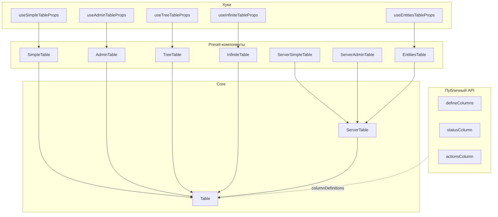

# Table

`@ds/table` — Таблица данных: клиентская Table, серверная ServerTable и preset-обёртки с упрощённым API.

Пакет `@ds/table` предоставляет таблицы поверх `@tanstack/react-table`: полнофункциональные `Table` / `ServerTable` и preset-обёртки с упрощённым API.

## Установка

```bash
pnpm add @ds/table
```

```ts
import { Table, ServerTable, SimpleTable, defineColumns } from '@ds/table';
```

## Смотри также

- **Pagination** — отдельный компонент пагинации.
- **InfoBlock** — основа пустых состояний таблицы.
- **Card** — самостоятельные карточки вне таблицы.
## Архитектура пакета



`defineColumns`, `statusColumn` и `actionsColumn` — публичные утилиты: ими собирают `columnDefinitions` для **`Table`** напрямую. Preset-ы дают тот же результат через упрощённые пропсы (`columns`, `statusColumn`, `rowActions` в `AdminTable`).

`ServerTable` — обёртка над `Table` для серверной пагинации, сортировки и фильтрации.

## Какой сценарий выбрать

### Компоненты

| Сценарий                                         

### Утилиты

| Сценарий                | Утилита                                             |
| ----------------------- | --------------------------------------------------- |
| Декларативные колонки   | **`defineColumns`** |
| Колонка статуса         | `statusColumn`                                      |
| Колонка действий строки | `actionsColumn`                                     |

Каждый preset доступен в двух формах: **компонент** (`<SimpleTable />`) и **хук** (`useSimpleTableProps()` + `<Table />`).

Карточный режим (`headlineKey`, `defaultView`, `view`) — сквозная опция всех preset-ов, не отдельный компонент.

## Table

Клиентская таблица данных: сортировка, поиск, выбор строк, пагинация, дерево, настройка колонок, режим карточек.

Клиентская таблица поверх `@tanstack/react-table`: данные передаются целиком, сортировка, поиск и пагинация выполняются локально. Служебные колонки — статус, выбор строки, действия, дерево — собираются готовыми фабриками.

Для типовых сценариев есть preset-обёртки с упрощённым API — см. **обзор пакета** и **`defineColumns`**. Для постраничных данных с бэкенда — **`ServerTable`**.

### Когда использовать

- Структурированные данные с одинаковым набором полей у каждой записи.
- Операции над строками: выбор, массовые действия, контекстные действия строки.
- Сравнение записей по колонкам: сортировка, фильтры, настройка видимости колонок.

Когда **не** нужен:

- Данные приходят с бэкенда постранично:
  - используйте **`ServerTable`**.
- Простой справочник без поиска и фильтров:
  - **`SimpleTable`** вместо ручной сборки `columnDefinitions`.
- Типичный админ-экран (поиск, статус, выбор, действия):
  - **`AdminTable`** вместо полного `Table`.
- Простой список без колонок и сортировки:
  - используйте список или карточки.

Рекомендации:

- ✅ Задавать `getRowId` по стабильному идентификатору данных при включённом выборе строк.
- ❌ Полагаться на индекс строки — при сортировке и фильтрации выбор переходит на другие записи.

- ✅ Для постраничных данных с бэкенда использовать **`ServerTable`** с `onChangePage`.
- ❌ Собирать `manualPagination` поверх `Table` вручную — это уже реализовано в `ServerTable`.

- ✅ Служебные колонки создавать фабриками `getStatusColumnDef` / `getRowActionsColumnDef` / `getTreeColumnDef`.
- ❌ Собирать закреплённую колонку статуса вручную — фабрика задаёт ширину, закрепление и отступы по дизайну.

- ✅ В режиме карточек передавать `headlineId` — id колонки, чей рендер становится заголовком карточки.
- ❌ Включать `view='cards'` без `headlineId` — карточки останутся без заголовка.

- ✅ Задавать уникальный `savedState.id` для каждой таблицы приложения.
- ❌ Использовать один id на несколько таблиц — сохранённые состояния перетирают друг друга в localStorage.

### Анатомия

#### View (default `table`, на mobile — `cards`)

Режим отображения данных (ось `VIEW`):

- `table` — классическая сетка со строками и колонками.
- `cards` — карточки с внешним бордером; заголовок карточки берётся из колонки `headlineId`, при множественном выборе на карточке отображается бэйдж выбора, при одиночном — radio; действия строки доступны на карточке.

Начальный вид зависит от раскладки (адаптивный дефолт): `table` на desktop, `cards` на mobile. Явные `defaultView` / `view` перекрывают его.

Управление режимом:

- `defaultView` — начальный режим для uncontrolled-сценария.
- `view` + `onViewChange` — управляемый режим.
- `showDataView` (default `false`) — показывать ли переключатель вида (сегмент-контрол в тулбаре). Управляет только видимостью тоггла; сам вид задаётся `view` / `defaultView`.

Три режима:

- **Только таблица / только карточки** (дефолт — тоггла нет) — вид задаётся `defaultView` (или адаптивным дефолтом: desktop `table`, mobile `cards`).
- **С переключателем** — `showDataView`; пользователь сам переключает table/cards, стартовый вид — `defaultView` / адаптивный дефолт.

Для «только таблицы» на mobile учтите адаптивный дефолт (`cards`): нужен `layoutPresets={{ mobile: { defaultView: 'table' } }}`.

Поведение в режиме карточек:

- `onRowClick` работает в обоих режимах — и в сетке, и на карточках.
- `suppressHeader` скрывает подписи-заголовки полей карточки.
- `getRowBackgroundColor` не применяется — карточки не тонируются.

#### Колонки (`columnDefinitions`)

`ColumnDefinition` — надстройка над `ColumnDef` из `@tanstack/react-table`:

- `header` — заголовок колонки (ReactNode или функция от контекста).
- `align` / `headerAlign` — выравнивание контента ячейки и заголовка (ось `COLUMN_ALIGN`: `left` / `right`).
- `size` — ширина колонки; меняется перетаскиванием за хэндл на границе заголовков.
- `pinned` — закрепление колонки (ось `COLUMN_PIN_POSITION`: `left` / `right`); закреплённая колонка обязана иметь `id` и `size`.
- `cellClassName` / `headerClassName` — CSS-классы ячеек тела и шапки.
- `noBodyCellPadding` / `noHeaderCellPadding` — отключение паддингов ячейки.
- `meta.skipOnExport` — пропуск колонки при экспорте.

#### Служебные колонки

Предопределённые колонки (идентификаторы — в `DefaultColumns`) создаются фабриками:

- `getStatusColumnDef` — закреплённая колонка статуса, рисуется компонентом **`Status`** из `@ds/status` (точка-индикатор + подпись): `mapStatusToAppearance` переводит значение поля в appearance, `renderDescription` задаёт текст подписи. Без `renderDescription` отрисовывается только точка-индикатор.
- `getSelectionCellColumnDef` — колонка с чекбоксом или radio выбора строки. В мультивыборе мастер-чекбокс «выбрать всё» рендерится в строке заголовков таблицы.
- `getRowActionsColumnDef` — колонка с кнопкой действий строки; пункты выпадающего списка собирает `actionsGenerator` по данным строки.
- `getTreeColumnDef` — колонка с chevron раскрытия дерева (передаётся в `expanding.expandingColumnDefinition`).

Значения `STATUS_APPEARANCE` для статус-колонки:

- `neutral` — нейтральный статус. `primary` — синий акцент (у `@ds/status` нет appearance `primary`, маппится на `blue`).
- `red` — ошибка, блокировка.
- `orange` / `yellow` — предупреждение.
- `green` — успешное состояние.
- `blue` / `violet` / `pink` — информационные и категорийные статусы.
- `loading` — спиннер вместо цветового индикатора.

Готовая ячейка `CopyCell` отображает значение с кнопкой копирования.

#### Сортировка (`sorting`)

- `initialState` — начальное состояние для uncontrolled-сценария.
- `state` + `onChange` — управляемый режим.

Функция сравнения задаётся на колонке через `sortingFn` (ось `SORT_FN`):

- `alphanumeric` — строки и числа.
- `datetime` — даты.

Для серверной сортировки — `manualSorting`: таблица не сортирует данные сама, только отдаёт состояние через `onChange`.

#### Выбор строк (`rowSelection`)

- `multiRow` — множественный выбор чекбоксами; без него — одиночный выбор radio.
- `enable` — предикат доступности выбора для конкретной строки.
- `appearance` — вид недоступной для выбора строки (ось `RowAppearance`):
  - `disabled` — заблокированный чекбокс;
  - `hide-toggler` — чекбокс скрыт.
- `initialState` / `state` + `onChange` — uncontrolled- и controlled-режимы.

Bulk-бар в тулбаре (чекбокс «выбрать все» и счётчик выбранных) появляется только при `rowSelection.multiRow`:

- `bulkActions` — массовые действия; `onClick` получает `selectionState` и `resetRowSelection`.
- `toolbarCheckBoxMode` — охват мастер-чекбокса выбора (ось `ToolbarCheckBoxMode`, только клиентская `Table`):
  - `pageRows` — строки текущей страницы;
  - `allRows` — все строки набора `data` (включая другие страницы пагинации).

  В `view='table'` мастер-чекбокс в заголовке колонки выбора; в `view='cards'` — в bulk-баре тулбара.

#### Поиск и фильтры

- `search` — глобальный поиск: `initialState` / `state` + `onChange`, `placeholder`, `loading`.
- `enableFuzzySearch` — нечёткий поиск вместо точного совпадения подстроки.
- `columnFilters` — строка фильтров-чипов над таблицей (`FilterRow`; `initialOpen` раскрывает её сразу).
- `dataFiltered` — флаг «данные отфильтрованы снаружи»: при пустых данных показывается `noResultsState`.
- `manualFiltering` — фильтрация на сервере: таблица не фильтрует данные сама.

#### Пагинация (default `pageSize` 10)

- `pageSize` — число строк на страницу.
- `pagination` — `state` + `onChange` (управляемый режим), `options` (варианты числа строк на страницу), `optionsLabel`, `optionsRender`.
- `suppressPagination` — отключение пагинации.
- `autoResetPageIndex` — сброс на первую страницу при изменении данных, фильтров или сортировки.
- `pageCount` — количество страниц при внешнем управлении.
- `infiniteLoading` — режим «бесконечной» загрузки; взаимоисключающая ветка типа: вместе с ним пропы `pagination` / `suppressPagination` / `toolbarCheckBoxMode` недоступны.

#### Дерево (`expanding`)

- `getSubRows` — функция получения дочерних строк элемента.
- `expandingColumnDefinition` — определение колонки с chevron (создаётся `getTreeColumnDef`).
- `state` + `onChange` — управляемый `ExpandedState`; без них раскрытие живёт во внутреннем состоянии.

#### Настройка колонок (`columnsSettings`)

- `enableDrag` — переупорядочивание колонок: перетаскивание заголовков в таблице и строк в меню настроек (через `onItemsReorder` у `@ds/list`). Оба канала пишут в один и тот же `columnOrder`.
- `enableSettingsMenu` — меню видимости колонок в тулбаре.

Поведение колонки в меню задаётся на самой колонке через `columnSettings.mode` (ось `COLUMN_SETTINGS_MODE`), режим по умолчанию — `defaultVisible`:

- `locked` — колонка есть в меню, но строка disabled (всегда видима, свитч нельзя выключить).
- `defaultVisible` — в меню, по умолчанию включена. Так ведёт себя колонка без `columnSettings.mode`.
- `defaultHidden` — в меню, по умолчанию выключена.

`columnSettings.label` — название колонки в меню настроек; без него берётся `header`. Служебные колонки (`selection` / `rowActions` / `status`) видимостью не управляются: первые две в меню не показываются, `status` — disabled.

`savedState` сохраняет состояние таблицы в localStorage и query-параметрах: `id` обязан быть уникальным в рамках приложения; `resize` / `columnSettings` включают сохранение ширин и видимости колонок; `serializer` / `parser` / `filterQueryKey` настраивают сериализацию фильтров.

#### Цвет строки

`getRowBackgroundColor(data)` возвращает цвет фона строки по её данным (ось `TABLE_ROW_COLOR`) или `undefined`:

- `red` / `orange` / `yellow` — ошибка и предупреждения.
- `green` — успешное состояние.
- `blue` / `violet` / `pink` — категорийная подсветка.
- `neutral` — нейтральное выделение.

Работает только в `view='table'` — карточки не тонируются.

#### Пустые состояния и загрузка

- `noDataState` — экран при отсутствии данных.
- `noResultsState` — экран при пустом результате поиска или фильтров.
- `errorDataState` — экран при ошибке запроса.
- Все три — `EmptyStateProps` поверх `InfoBlock`.
- `loading` — skeleton-строки на время загрузки.
- Флаги `dataFiltered` / `dataError` определяют, какой из экранов показывается при пустых данных.

#### Тулбар

- `suppressToolbar` — скрыть тулбар целиком.
- `suppressSearch` — скрыть строку поиска.
- `suppressHeader` — скрыть шапку таблицы; в режиме карточек — подписи полей карточки.
- `moreActions` — пункты выпадающего списка кнопки дополнительных действий.
- `toolbarAfter` — дополнительный слот после строки поиска.
- `onRefresh` — кнопка обновления данных.
- `outline` — внешний бордер вокруг тулбара и таблицы.
- `fullWidth` — растягивание на ширину контейнера (`true` по умолчанию). При `false` на desktop ширина таблицы определяется суммой колонок; на mobile всегда `true` (`TABLE_LAYOUT_PRESETS`). Лучше всего работает, когда у всех колонок задан `size`. Если нужна fluid-колонка на остаток ширины — оставьте `fullWidth={true}` и не задавайте `size` хотя бы одной колонке.

### Примеры использования

{/* client:only='react': SSR демо невозможен — @ds/list использует в dist directory-imports, которые Node-ESM не резолвит (тот же паттерн, что в @ds/chips). */}

#### Базовая таблица

Колонки с выравниванием и форматированием, `outline`, пагинация с выбором числа строк.

```tsx
import { ColumnDefinition, Table } from '@ds/table';

type User = {
  id: string;
  name: string;
  email: string;
  role: string;
  balance: number;
};

const USERS: User[] = [
  { id: 'u-1', name: 'Анна Иванова', email: 'anna.ivanova@example.com', role: 'Owner', balance: 12990 },
  { id: 'u-2', name: 'Борис Петров', email: 'boris.petrov@example.com', role: 'Admin', balance: 8450 },
  { id: 'u-3', name: 'Вера Сидорова', email: 'vera.sidorova@example.com', role: 'Editor', balance: 4300 },
  { id: 'u-4', name: 'Глеб Кузнецов', email: 'gleb.kuznetsov@example.com', role: 'Viewer', balance: 0 },
  { id: 'u-5', name: 'Дарья Орлова', email: 'darya.orlova@example.com', role: 'Editor', balance: 990 },
  { id: 'u-6', name: 'Егор Морозов', email: 'egor.morozov@example.com', role: 'Admin', balance: 15600 },
  { id: 'u-7', name: 'Жанна Волкова', email: 'zhanna.volkova@example.com', role: 'Viewer', balance: 2100 },
  { id: 'u-8', name: 'Захар Соколов', email: 'zakhar.sokolov@example.com', role: 'Editor', balance: 7800 },
];

const balanceFormatter = new Intl.NumberFormat('ru-RU', {
  style: 'currency',
  currency: 'RUB',
  maximumFractionDigits: 0,
});

const columns: ColumnDefinition<User>[] = [
  { accessorKey: 'name', header: 'Имя', enableSorting: true, size: 200 },
  { accessorKey: 'email', header: 'Email', size: 240 },
  { accessorKey: 'role', header: 'Роль', enableSorting: true, size: 140 },
  {
    accessorKey: 'balance',
    header: 'Баланс',
    align: 'right',
    headerAlign: 'right',
    enableSorting: true,
    size: 140,
    cell: ctx => balanceFormatter.format(Number(ctx.getValue() ?? 0)),
  },
];

export function Basic() {
  return <Table data={USERS} columnDefinitions={columns} pageSize={5} pagination={{ options: [5, 10] }} outline />;
}
```

#### Управляемая сортировка

`sorting.state` + `onChange`, начальная сортировка по убыванию суммы.

```tsx
import { ColumnDefinition, SortingState, Table } from '@ds/table';
import { useState } from 'react';

type User = {
  id: string;
  name: string;
  email: string;
  role: string;
  amount: number;
};

const USERS: User[] = [
  { id: 'u-1', name: 'Анна Иванова', email: 'anna.ivanova@example.com', role: 'Owner', amount: 12990 },
  { id: 'u-2', name: 'Борис Петров', email: 'boris.petrov@example.com', role: 'Admin', amount: 8450 },
  { id: 'u-3', name: 'Вера Сидорова', email: 'vera.sidorova@example.com', role: 'Editor', amount: 4300 },
  { id: 'u-4', name: 'Глеб Кузнецов', email: 'gleb.kuznetsov@example.com', role: 'Viewer', amount: 0 },
  { id: 'u-5', name: 'Дарья Орлова', email: 'darya.orlova@example.com', role: 'Editor', amount: 990 },
  { id: 'u-6', name: 'Егор Морозов', email: 'egor.morozov@example.com', role: 'Admin', amount: 15600 },
];

const columns: ColumnDefinition<User>[] = [
  { accessorKey: 'name', header: 'Имя', enableSorting: true, size: 200 },
  { accessorKey: 'email', header: 'Email', enableSorting: true, size: 260 },
  { accessorKey: 'role', header: 'Роль', enableSorting: true, size: 140 },
  { accessorKey: 'amount', header: 'Баланс', align: 'right', headerAlign: 'right', enableSorting: true, size: 140 },
];

export function Sorting() {
  const [sorting, setSorting] = useState<SortingState>([{ id: 'amount', desc: true }]);

  return (
    <Table
      data={USERS}
      columnDefinitions={columns}
      sorting={{ state: sorting, onChange: setSorting }}
      suppressPagination
      outline
    />
  );
}
```

#### Статус-колонка и цвет строки

`getStatusColumnDef` с подписью в тултипе и подкраска строк через `getRowBackgroundColor`.

```tsx
import {
  ColumnDefinition,
  getStatusColumnDef,
  MapStatusToAppearanceFnType,
  STATUS_APPEARANCE,
  Table,
  TABLE_ROW_COLOR,
} from '@ds/table';

type User = {
  id: string;
  name: string;
  email: string;
  role: string;
  status: string;
};

const USERS: User[] = [
  { id: 'u-1', name: 'Анна Иванова', email: 'anna.ivanova@example.com', role: 'Owner', status: 'active' },
  { id: 'u-2', name: 'Борис Петров', email: 'boris.petrov@example.com', role: 'Admin', status: 'pending' },
  { id: 'u-3', name: 'Вера Сидорова', email: 'vera.sidorova@example.com', role: 'Editor', status: 'blocked' },
  { id: 'u-4', name: 'Глеб Кузнецов', email: 'gleb.kuznetsov@example.com', role: 'Viewer', status: 'invited' },
  { id: 'u-5', name: 'Дарья Орлова', email: 'darya.orlova@example.com', role: 'Editor', status: 'active' },
  { id: 'u-6', name: 'Егор Морозов', email: 'egor.morozov@example.com', role: 'Admin', status: 'blocked' },
];

const STATUS_LABELS: Record<string, string> = {
  active: 'Активен',
  pending: 'Ожидание',
  blocked: 'Заблокирован',
  invited: 'Приглашён',
};

const mapStatusToAppearance: MapStatusToAppearanceFnType = value => {
  switch (value) {
    case 'active':
      return STATUS_APPEARANCE.Green;
    case 'pending':
      return STATUS_APPEARANCE.Yellow;
    case 'blocked':
      return STATUS_APPEARANCE.Red;
    case 'invited':
      return STATUS_APPEARANCE.Blue;
    default:
      return STATUS_APPEARANCE.Neutral;
  }
};

const columns: ColumnDefinition<User>[] = [
  getStatusColumnDef<User>({
    accessorKey: 'status',
    mapStatusToAppearance,
    renderDescription: value => STATUS_LABELS[value] ?? value,
    header: 'Статус',
    size: 160,
  }),
  { accessorKey: 'name', header: 'Имя', size: 200 },
  { accessorKey: 'email', header: 'Email', size: 260 },
  { accessorKey: 'role', header: 'Роль', size: 140 },
];

export function StatusColumn() {
  return (
    <Table
      data={USERS}
      columnDefinitions={columns}
      getRowBackgroundColor={user => (user.status === 'blocked' ? TABLE_ROW_COLOR.Red : undefined)}
      suppressPagination
      outline
    />
  );
}
```

#### Выбор строк и массовые действия

Множественный выбор, bulk-бар с действием удаления и `resetRowSelection`.

```tsx
import { TrashSVG } from '@ds/icons/interface/system';
import { ColumnDefinition, RowSelectionState, Table } from '@ds/table';
import { useState } from 'react';

type User = {
  id: string;
  name: string;
  email: string;
  role: string;
};

const INITIAL_USERS: User[] = [
  { id: 'u-1', name: 'Анна Иванова', email: 'anna.ivanova@example.com', role: 'Owner' },
  { id: 'u-2', name: 'Борис Петров', email: 'boris.petrov@example.com', role: 'Admin' },
  { id: 'u-3', name: 'Вера Сидорова', email: 'vera.sidorova@example.com', role: 'Editor' },
  { id: 'u-4', name: 'Глеб Кузнецов', email: 'gleb.kuznetsov@example.com', role: 'Viewer' },
  { id: 'u-5', name: 'Дарья Орлова', email: 'darya.orlova@example.com', role: 'Editor' },
  { id: 'u-6', name: 'Егор Морозов', email: 'egor.morozov@example.com', role: 'Admin' },
];

const columns: ColumnDefinition<User>[] = [
  { accessorKey: 'name', header: 'Имя', size: 200 },
  { accessorKey: 'email', header: 'Email', size: 260 },
  { accessorKey: 'role', header: 'Роль', size: 140 },
];

export function Selection() {
  const [users, setUsers] = useState<User[]>(INITIAL_USERS);
  const [selection, setSelection] = useState<RowSelectionState>({ 'u-2': true });

  return (
    <Table
      data={users}
      columnDefinitions={columns}
      getRowId={user => user.id}
      rowSelection={{ enable: true, multiRow: true, state: selection, onChange: setSelection }}
      bulkActions={[
        {
          label: 'Удалить выбранные',
          icon: TrashSVG,
          onClick: (selectionState, resetRowSelection) => {
            setUsers(prev => prev.filter(user => !selectionState[user.id]));
            setSelection({});
            resetRowSelection();
          },
        },
      ]}
      suppressPagination
      outline
    />
  );
}
```

#### Действия строки

`getRowActionsColumnDef` с выпадающим списком: пункты меняют данные строки.

```tsx
import { ColumnDefinition, getRowActionsColumnDef, Table } from '@ds/table';
import { useMemo, useState } from 'react';

type User = {
  id: string;
  name: string;
  email: string;
  status: 'active' | 'blocked';
};

const INITIAL_USERS: User[] = [
  { id: 'u-1', name: 'Анна Иванова', email: 'anna.ivanova@example.com', status: 'active' },
  { id: 'u-2', name: 'Борис Петров', email: 'boris.petrov@example.com', status: 'active' },
  { id: 'u-3', name: 'Вера Сидорова', email: 'vera.sidorova@example.com', status: 'blocked' },
  { id: 'u-4', name: 'Глеб Кузнецов', email: 'gleb.kuznetsov@example.com', status: 'active' },
  { id: 'u-5', name: 'Дарья Орлова', email: 'darya.orlova@example.com', status: 'blocked' },
];

export function RowActions() {
  const [users, setUsers] = useState<User[]>(INITIAL_USERS);

  const columns = useMemo<ColumnDefinition<User>[]>(
    () => [
      { accessorKey: 'name', header: 'Имя', size: 200 },
      { accessorKey: 'email', header: 'Email', size: 260 },
      {
        accessorKey: 'status',
        header: 'Статус',
        size: 160,
        cell: ctx => (ctx.getValue() === 'blocked' ? 'Заблокирован' : 'Активен'),
      },
      getRowActionsColumnDef<User>({
        pinned: true,
        actionsGenerator: cell => {
          const user = cell.row.original;

          return [
            {
              content: { label: user.status === 'blocked' ? 'Активировать' : 'Заблокировать' },
              onClick: () =>
                setUsers(prev =>
                  prev.map(item =>
                    item.id === user.id ? { ...item, status: item.status === 'blocked' ? 'active' : 'blocked' } : item,
                  ),
                ),
            },
            {
              content: { label: 'Удалить' },
              onClick: () => setUsers(prev => prev.filter(item => item.id !== user.id)),
            },
          ];
        },
      }),
    ],
    [],
  );

  return <Table data={users} columnDefinitions={columns} getRowId={user => user.id} suppressPagination outline />;
}
```

#### Дерево

Иерархические данные через `expanding.getSubRows` + `getTreeColumnDef`.

```tsx
import { ColumnDefinition, Table } from '@ds/table';

type OrgNode = {
  id: string;
  name: string;
  type: string;
  email: string;
  subRows?: OrgNode[];
};

const ORG_TREE: OrgNode[] = [
  {
    id: 'org-cloud',
    name: 'Cloud Platform',
    type: 'Организация',
    email: 'platform@example.com',
    subRows: [
      {
        id: 'team-compute',
        name: 'Compute',
        type: 'Команда',
        email: 'compute@example.com',
        subRows: [
          { id: 'p-1', name: 'Анна Иванова', type: 'Owner', email: 'anna.ivanova@example.com' },
          { id: 'p-2', name: 'Борис Петров', type: 'Admin', email: 'boris.petrov@example.com' },
        ],
      },
      {
        id: 'team-storage',
        name: 'Storage',
        type: 'Команда',
        email: 'storage@example.com',
        subRows: [{ id: 'p-3', name: 'Вера Сидорова', type: 'Editor', email: 'vera.sidorova@example.com' }],
      },
    ],
  },
  {
    id: 'org-data',
    name: 'Data Platform',
    type: 'Организация',
    email: 'data@example.com',
    subRows: [{ id: 'p-4', name: 'Егор Морозов', type: 'Admin', email: 'egor.morozov@example.com' }],
  },
];

// `name` рендерится tree-колонкой (`expandingColumnDefinition`), поэтому
// в обычных колонках его нет — иначе значение продублируется.
const columns: ColumnDefinition<OrgNode>[] = [
  { accessorKey: 'type', header: 'Тип', size: 160 },
  { accessorKey: 'email', header: 'Email', size: 260 },
];

export function Tree() {
  return (
    <Table
      data={ORG_TREE}
      columnDefinitions={columns}
      getRowId={node => node.id}
      expanding={{
        getSubRows: node => node.subRows,
        expandingColumnDefinition: { accessorKey: 'name', header: 'Подразделение' },
      }}
      suppressPagination
      outline
    />
  );
}
```

#### Настройка колонок

Перетаскивание заголовков и строк в меню настроек (`enableDrag`) плюс видимость колонок (`enableSettingsMenu`).

```tsx
import { COLUMN_SETTINGS_MODE, ColumnDefinition, Table } from '@ds/table';

type User = {
  id: string;
  name: string;
  email: string;
  role: string;
  createdAt: string;
};

const USERS: User[] = [
  { id: 'u-1', name: 'Анна Иванова', email: 'anna.ivanova@example.com', role: 'Owner', createdAt: '12.01.2026' },
  { id: 'u-2', name: 'Борис Петров', email: 'boris.petrov@example.com', role: 'Admin', createdAt: '03.02.2026' },
  { id: 'u-3', name: 'Вера Сидорова', email: 'vera.sidorova@example.com', role: 'Editor', createdAt: '18.03.2026' },
  { id: 'u-4', name: 'Глеб Кузнецов', email: 'gleb.kuznetsov@example.com', role: 'Viewer', createdAt: '27.04.2026' },
  { id: 'u-5', name: 'Дарья Орлова', email: 'darya.orlova@example.com', role: 'Editor', createdAt: '09.05.2026' },
];

const columns: ColumnDefinition<User>[] = [
  // `mode: Hidden` — колонка не показывается в меню настроек и видна всегда.
  {
    accessorKey: 'name',
    header: 'Имя',
    size: 200,
    columnSettings: { label: 'Имя', mode: COLUMN_SETTINGS_MODE.Locked },
  },
  { accessorKey: 'email', header: 'Email', size: 240, columnSettings: { label: 'Email' } },
  { accessorKey: 'role', header: 'Роль', size: 140, columnSettings: { label: 'Роль' } },
  // `mode: DefaultFalse` — колонка скрыта по умолчанию, включается из меню настроек.
  {
    accessorKey: 'createdAt',
    header: 'Создан',
    size: 160,
    columnSettings: { label: 'Дата создания', mode: COLUMN_SETTINGS_MODE.DefaultHidden },
  },
];

export function ColumnSettings() {
  return (
    <Table
      data={USERS}
      columnDefinitions={columns}
      columnsSettings={{ enableDrag: true, enableSettingsMenu: true }}
      suppressPagination
      outline
    />
  );
}
```

#### Режим карточек

`defaultView="cards"` + `showDataView` + `headlineId`; переключатель table/cards в тулбаре.

```tsx
import { ColumnDefinition, Table, VIEW } from '@ds/table';

type User = {
  id: string;
  name: string;
  email: string;
  role: string;
  balance: number;
};

const USERS: User[] = [
  { id: 'u-1', name: 'Анна Иванова', email: 'anna.ivanova@example.com', role: 'Owner', balance: 12990 },
  { id: 'u-2', name: 'Борис Петров', email: 'boris.petrov@example.com', role: 'Admin', balance: 8450 },
  { id: 'u-3', name: 'Вера Сидорова', email: 'vera.sidorova@example.com', role: 'Editor', balance: 4300 },
  { id: 'u-4', name: 'Глеб Кузнецов', email: 'gleb.kuznetsov@example.com', role: 'Viewer', balance: 0 },
  { id: 'u-5', name: 'Дарья Орлова', email: 'darya.orlova@example.com', role: 'Editor', balance: 990 },
  { id: 'u-6', name: 'Егор Морозов', email: 'egor.morozov@example.com', role: 'Admin', balance: 15600 },
];

const columns: ColumnDefinition<User>[] = [
  { accessorKey: 'name', header: 'Имя', enableSorting: true, size: 200 },
  { accessorKey: 'email', header: 'Email', size: 240 },
  { accessorKey: 'role', header: 'Роль', size: 140 },
  { accessorKey: 'balance', header: 'Баланс', enableSorting: true, size: 140 },
];

export function CardView() {
  return (
    <Table
      data={USERS}
      columnDefinitions={columns}
      // Стартовый вид — карточки; `showDataView` включает переключатель table/cards
      // в тулбаре (по умолчанию его нет). `headlineId` задаёт заголовок карточки.
      defaultView={VIEW.Cards}
      showDataView
      headlineId='name'
      getRowId={user => user.id}
      rowSelection={{ enable: true, multiRow: true }}
      sorting={{ initialState: [{ id: 'name', desc: false }] }}
      outline
    />
  );
}
```

#### Мобильная раскладка

`AdaptiveProvider layoutType="mobile"` + `defaultView="cards"` — список карточек; в table-виде на mobile — сетка строк. По умолчанию `stickyControls.enabled: true`, offsets `0`; отступ под sticky header документации — `layoutPresets.mobile`.

```tsx
import { AdaptiveProvider, LAYOUT_TYPE } from '@ds/adaptive';
import {
  ColumnDefinition,
  getStatusColumnDef,
  MapStatusToAppearanceFnType,
  STATUS_APPEARANCE,
  Table,
  VIEW,
} from '@ds/table';

type User = {
  id: string;
  name: string;
  email: string;
  role: string;
  status: string;
};

const USERS: User[] = [
  { id: 'u-1', name: 'Анна Иванова', email: 'anna@example.com', role: 'Owner', status: 'active' },
  { id: 'u-2', name: 'Борис Петров', email: 'boris@example.com', role: 'Admin', status: 'pending' },
  { id: 'u-3', name: 'Вера Сидорова', email: 'vera@example.com', role: 'Editor', status: 'active' },
];

const mapStatusToAppearance: MapStatusToAppearanceFnType = value =>
  value === 'active' ? STATUS_APPEARANCE.Green : STATUS_APPEARANCE.Orange;

const columns: ColumnDefinition<User>[] = [
  getStatusColumnDef<User>({
    accessorKey: 'status',
    mapStatusToAppearance,
    renderDescription: value => (value === 'active' ? 'Активен' : 'Ожидает'),
    header: 'Статус',
    size: 160,
  }),
  { accessorKey: 'name', header: 'Имя', enableSorting: true },
  { accessorKey: 'email', header: 'Email' },
  { accessorKey: 'role', header: 'Роль' },
];

/** Высота sticky header сайта документации (`apps/docs` → `$docs-header-height`). */
const DOCS_HEADER_HEIGHT = 52;

export function MobileLayout() {
  return (
    <AdaptiveProvider layoutType={LAYOUT_TYPE.Mobile}>
      <div style={{ maxWidth: 375 }}>
        <Table
          data={USERS}
          columnDefinitions={columns}
          defaultView={VIEW.Cards}
          headlineId='name'
          sorting={{}}
          columnsSettings={{ enableSettingsMenu: true }}
          layoutPresets={{
            mobile: {
              stickyControls: { enabled: true, offsetTop: DOCS_HEADER_HEIGHT, offsetBottom: 0 },
            },
          }}
          outline
        />
      </div>
    </AdaptiveProvider>
  );
}
```

#### Ширина таблицы

По умолчанию таблица растягивается на контейнер (`fullWidth`). При `fullWidth={false}` на desktop обводка и сетка сжимаются до суммы фиксированных колонок — удобно в модалках и узких формах. На mobile режим fit-content не применяется.

```tsx
import { ColumnDefinition, Table } from '@ds/table';

type User = {
  id: string;
  name: string;
  email: string;
  role: string;
  balance: number;
};

const USERS: User[] = [
  { id: 'u-1', name: 'Анна Иванова', email: 'anna.ivanova@example.com', role: 'Owner', balance: 12990 },
  { id: 'u-2', name: 'Борис Петров', email: 'boris.petrov@example.com', role: 'Admin', balance: 8450 },
  { id: 'u-3', name: 'Вера Сидорова', email: 'vera.sidorova@example.com', role: 'Editor', balance: 4300 },
  { id: 'u-4', name: 'Глеб Кузнецов', email: 'gleb.kuznetsov@example.com', role: 'Viewer', balance: 0 },
  { id: 'u-5', name: 'Дарья Орлова', email: 'darya.orlova@example.com', role: 'Editor', balance: 990 },
];

const balanceFormatter = new Intl.NumberFormat('ru-RU', {
  style: 'currency',
  currency: 'RUB',
  maximumFractionDigits: 0,
});

const columns: ColumnDefinition<User>[] = [
  { accessorKey: 'name', header: 'Имя', enableSorting: true, size: 200 },
  { accessorKey: 'email', header: 'Email', size: 240 },
  { accessorKey: 'role', header: 'Роль', enableSorting: true, size: 140 },
  {
    accessorKey: 'balance',
    header: 'Баланс',
    align: 'right',
    headerAlign: 'right',
    enableSorting: true,
    size: 140,
    cell: ctx => balanceFormatter.format(Number(ctx.getValue() ?? 0)),
  },
];

const tableProps = {
  data: USERS,
  columnDefinitions: columns,
  pageSize: 5,
  pagination: { options: [5, 10] },
  outline: true,
  suppressToolbar: true,
};

export function FullWidth() {
  return (
    <div style={{ display: 'flex', flexDirection: 'column', gap: 24, width: '100%', maxWidth: 960 }}>
      <Table {...tableProps} />
      <Table {...tableProps} fullWidth={false} />
    </div>
  );
}
```

### Props

**TableProps**

| Prop | Type | Default | Description |
|------|------|---------|-------------|
| `autoResetPageIndex` | `boolean` | `false` | Автоматический сброс пагинации к первой странице при изменении данных/фильтров/сортировки |
| `bulkActions` | `BulkAction` | — | Список действий для массовых операций |
| `cardColumns` | `number` | — | Желаемое число колонок карточного вида (`view='cards'`). <br/> На широком контейнере рисуется ровно столько колонок; при сужении сетка <br/> схлопывается до меньшего числа (порог — `cardMinWidth`). Без пропа число <br/> колонок определяется только шириной контейнера и `cardMinWidth` (auto-fill). |
| `cardMinWidth` | `number` | `320` | Минимальная ширина карточки в `view='cards'`, px. Порог, ниже которого <br/> колонки схлопываются. Карточка ужимается до ширины контейнера, если он уже. |
| `className` | `string` | — | CSS-класс |
| `columnDefinitions` | `ColumnDefinition` \| `Except` | — | Определение внешнего вида и функционала колонок |
| `columnFilters` | `FilterRow` | — | Фильтры |
| `columnVirtualizerInstanceRef` | `ColumnVirtualizer` | — | Ref на инстанс column-virtualizer'а для управления прокруткой снаружи |
| `columnVirtualizerOptions` | `Partial<VirtualizerOptions<HTMLElement, Element>>` | — | Дополнительные параметры column-virtualizer'а (`@tanstack/react-virtual`). <br/> Переопределяют дефолты (overscan=3). |
| `columnsSettings` | `{ enableDrag?: boolean; enableSettingsMenu?: boolean; } \| undefined` | — | Настройки колонок: `enableDrag` — переупорядочивание (заголовки таблицы и строки в меню настроек); <br/> `enableSettingsMenu` — меню показа колонок. |
| `copyPinnedRows` | `boolean` | `false` | Параметр отвечает за сохранение закрепленных строк в теле таблицы |
| `data` | `TData[]` | — | Данные для отрисовки |
| `data-test-id` | `string` | — |  |
| `dataError` | `boolean` | — | Флаг, показывающий что произошла ошибка запроса при пустых данных |
| `dataFiltered` | `boolean` | — | Флаг, показывающий что данные были отфильтрованы при пустых данных |
| `defaultView` | `"cards"` \| `"table"` | `'table' (на mobile — `cards`)` | Начальный режим отображения (uncontrolled). <br/> Если не задан — дефолт по раскладке: `table` на desktop, `cards` на mobile (`TABLE_LAYOUT_PRESETS`). |
| `enableColumnVirtualization` | `boolean` | `false` | Включает виртуализацию колонок (windowing по горизонтали). <br/> Рекомендуется при > 30 видимых колонок. Несовместимо с `view='cards'`. <br/> Pinned-колонки (left/right) всегда отрисовываются вне зависимости от настройки. |
| `enableFuzzySearch` | `boolean` | — | Включить нечеткий поиск |
| `enableRowVirtualization` | `boolean` | `false` | Включает виртуализацию строк (windowing по вертикали). <br/> Рекомендуется при > 200 строк. Несовместимо с `view='cards'` — при картах игнорируется. |
| `enableSelectPinned` | `boolean` | `false` | Параметр отвечает за чекбокс выбора закрепленных строк |
| `errorDataState` | `EmptyStateProps` | — | Экран при ошибке запроса |
| `expanding` | `TreeColumnDefinitionProps` | — | Общие настройки раскрывающихся (tree) строк: `getSubRows`, `expandingColumnDefinition`, <br/> `initialState`, `state`, `onChange`. |
| `fullWidth` | `boolean` | `true` | Растягивать таблицу на всю ширину контейнера. <br/> При `false` ширина определяется суммой колонок (лучше всего, когда у всех колонок задан `size` / `width`). <br/> Явный проп = desktop-значение; на mobile всегда `true` (`TABLE_LAYOUT_PRESETS`). |
| `getRowBackgroundColor` | `TableRowColor` | — | Функция определения цвета фона строки по её данным. <br/> Работает только в `view='table'` — карточки (`view='cards'`) не тонируются. <br/> @param data данные строки <br/> @returns цвет фона строки или `undefined` |
| `getRowId` | `((originalRow: TData, index: number, parent?: Row<TData>) => string)` | — | Функция получения уникального идентификатора строки |
| `hasMore` | `boolean` | — | Есть ли ещё данные для загрузки. Управляет видимостью кнопки / активностью observer-а. |
| `headerRowBackgroundColor` | `"blue"` \| `"green"` \| `"neutral"` \| `"orange"` \| `"pink"` \| `"red"` \| `"violet"` \| `"yellow"` | — | Accent-тон фона строки заголовков колонок (`tableHeadLine`). <br/> Работает только в `view='table'`. |
| `headlineId` | `string` | — | Id колонки, чей рендер используется как заголовок карточки в режиме `view='cards'`. <br/> Имеет смысл только при `view='cards'`. |
| `infiniteLoading` | `boolean` | `false` | Режим работы "бесконечной" загрузки |
| `keepPinnedRows` | `boolean` | `false` | Параметр отвечает за отображение закрепленных строк на всех страницах таблицы |
| `layoutPresets` | `LayoutPresets` \| `TableLayoutDefaults` | — | Override дефолтов адаптива для этого инстанса (`mergePresets` поверх `TABLE_LAYOUT_PRESETS`). <br/> `stickyControls` в пресете tier'а заменяет DS-объект целиком — указывайте все нужные поля. <br/> Escape-hatch: обычно не нужен — DS-пресет применяется автоматически по `AdaptiveProvider`. |
| `loadMoreTrigger` | `"button"` \| `"scroll"` | `scroll` | Механизм подгрузки следующей порции данных. <br/> - `'scroll'` (по умолчанию) — IntersectionObserver на scroll-stub в конце списка. <br/> - `'button'` — кнопка «Загрузить ещё» под таблицей. |
| `loading` | `boolean` | `false` | Состояние загрузки |
| `manualFiltering` | `boolean` | `false` |  |
| `manualPagination` | `boolean` | `false` |  |
| `manualSorting` | `boolean` | `false` |  |
| `moreActions` | `ToolbarProps` | — | Элементы выпадающего списка кнопки с действиями |
| `noDataState` | `EmptyStateProps` | — | Экран при отсутствии данных |
| `noResultsState` | `EmptyStateProps` | — | Экран при отсутствии результатов поиска или фильтров |
| `onExport` | `(() => void)` | — | Колбэк экспорта данных. Рендерит иконку в тулбаре перед настройками колонок. |
| `onLoadMore` | `(() => void)` | — | Колбэк дозагрузки следующей порции данных. <br/> В режиме `loadMoreTrigger='scroll'` вызывается автоматически при достижении конца списка; <br/> в режиме `loadMoreTrigger='button'` — по нажатию кнопки «Загрузить ещё». |
| `onRefresh` | `(() => void)` | — | Колбэк обновления данных |
| `onRowClick` | `RowClickHandler` | — | Колбэк клика по строке |
| `onViewChange` | `((view: View) => void)` | — | Колбэк на смену режима отображения |
| `outline` | `boolean` | `false` | Внешний бордер для тулбара и таблицы |
| `pageCount` | `number` | — | Кол-во страниц (для внешнего управления) |
| `pageSize` | `number` | `10` | Максимальное кол-во строк на страницу |
| `pagination` | `{ state?: PaginationState; options?: number[]; optionsLabel?: string \| undefined; onChange?(state: PaginationState): void; optionsRender?(value: string \| number, idx: number): string \| number; } \| undefined` | — | Параметры пагинации: `state`, `options`, `optionsLabel`, `onChange`, `optionsRender`. |
| `renderCard` | `((context: RenderCardContext<TData>) => ReactNode)` | — | Кастомный рендер карточки в `view='cards'`. Получает контекст с tanstack <br/> `row` / `table` и `defaultRender` (готовый элемент дефолтной карточки — <br/> можно обернуть). Возврат заменяет дефолтную карточку. |
| `rowAutoHeight` | `boolean` | — |  |
| `rowPinning` | `Pick<RowPinningState, "top">` | `{     top: [],   }` | Определение, какие строки должны быть закреплены в таблице |
| `rowSelection` | `RowAppearance` | — | Параметры выбора строк: `initialState`, `state`, `enable`, `appearance`, `multiRow`, `onChange`. |
| `rowVirtualizerInstanceRef` | `RowVirtualizer` | — | Ref на инстанс row-virtualizer'а для управления прокруткой снаружи |
| `rowVirtualizerOptions` | `Partial<VirtualizerOptions<HTMLElement, Element>>` | — | Дополнительные параметры row-virtualizer'а (`@tanstack/react-virtual`). <br/> Переопределяют дефолты (overscan=10, estimateSize=40). |
| `savedState` | `ToolbarPersistConfig` | — | Конфиг сохранения состояния в localStorage и queryParams. <br/> `id` должен быть уникальным для разных таблиц в рамках приложения. |
| `scrollContainerRef` | `RefObject<HTMLElement>` | — | Ссылка на контейнер, который скроллится |
| `scrollRef` | `Ref<HTMLElement>` | — | Ссылка на элемент, обозначающий самый конец прокручиваемого списка |
| `search` | `{ initialState?: string; state?: string; placeholder?: string \| undefined; loading?: boolean \| undefined; onChange?(value: string): void; } \| undefined` | — | Параметры глобального поиска: `initialState`, `state`, `placeholder`, `loading`, `onChange`. |
| `showDataView` | `boolean` | `false` | Показывать переключатель вида (таблица/карточки) в тулбаре. <br/> Управляет только видимостью тоггла; сам вид задаётся `view` / `defaultView`. <br/> По умолчанию тоггла нет — таблица показывает один вид (`defaultView` либо <br/> адаптивный дефолт). Включите `showDataView`, чтобы дать пользователю <br/> переключать table/cards. |
| `sorting` | `{ initialState?: SortingState; state?: SortingState; onChange?(state: SortingState): void; } \| undefined` | — | Параметры отвечают за возможность сортировки: <br/> `initialState` — начальное состояние; `state` — управляемое снаружи; `onChange` — колбэк на изменение. |
| `stickyControls` | `StickyControls` | — | Sticky-хром при скролле страницы: при `enabled: true` тулбар и пагинация липнут к верху/низу <br/> viewport, в table-view заголовок колонок — под тулбаром; тело растёт по контенту. <br/> При `enabled: false` все блоки идут сплошным потоком без sticky. <br/> Дефолты: desktop — `enabled: false` (offsets не применяются); <br/> mobile — `{ enabled: true, offsetTop: 0, offsetBottom: 0 }` (`TABLE_LAYOUT_PRESETS`); <br/> `backgroundPredefined` — `neutralBackground1Level` на всех раскладках. <br/> Явный проп = desktop-значение; mobile-override — `layoutPresets.mobile`. <br/> @example `stickyControls={{ enabled: true, offsetTop: 64 }}` — sticky на desktop, app header 64px. |
| `suppressHeader` | `boolean` | `false` | Отключение хедера таблицы; в режиме `view='cards'` скрывает подписи-заголовки полей карточки |
| `suppressPagination` | `boolean` | `false` | Отключение пагинации |
| `suppressSearch` | `boolean` | `false` | Отключение поиска |
| `suppressToolbar` | `boolean` | `false` | Отключение тулбара |
| `toolbarAfter` | `ReactNode` | — | Дополнительный слот в `Toolbar` после строки поиска |
| `toolbarCheckBoxMode` | `"allRows"` \| `"pageRows"` | — | Охват мастер-чекбокса выбора: текущая страница или все строки `data` (только клиентская таблица) |
| `view` | `"cards"` \| `"table"` | `'table' (на mobile — `cards`)` | Режим отображения таблицы (controlled). <br/> `table` — классическая сетка; `cards` — карточки (заголовок берётся из колонки `headlineId`). <br/> Переключатель вида в тулбаре включается отдельным пропом `showDataView`. |

##### Related types

**BulkAction**

| Prop | Type | Default | Description |
|------|------|---------|-------------|
| `data-test-id` | `string \| undefined` | — |  |
| `disabled` | `boolean \| undefined` | — |  |
| `icon` | `((props: { className?: string; }, deprecatedLegacyContext?: any) => ReactNode) \| (new (props: { className?: string; }, deprecatedLegacyContext?: any) => Component<any, any>)` | — |  |
| `label` | `string` | — |  |
| `onClick` | `((selectionState: RowSelectionState, resetRowSelection: (defaultState?: boolean) => void) => void) \| undefined` | — |  |
| `tooltip` | `TooltipProps` | — |  |

- `ColumnDefinition` = `NormalColumnDefinition<TData> | PinnedColumnDefinition<TData> | FilterableColumnDefinition<TData>`

- `ColumnVirtualizer` = `Virtualizer<HTMLElement, Element> | null`

**EmptyStateProps**

| Prop | Type | Default | Description |
|------|------|---------|-------------|
| `className` | `string \| undefined` | — | Дополнительный класс |
| `content` | `string \| number \| boolean \| ReactElement<any, string \| JSXElementConstructor<any>> \| Iterable<ReactNode> \| ReactPortal \| null \| undefined` | — | Подзаголовок |
| `footer` | `string \| number \| boolean \| ReactElement<any, string \| JSXElementConstructor<any>> \| Iterable<ReactNode> \| ReactPortal \| null \| undefined` | — | Вложенный контент (например ButtonGroup) |
| `icon` | `IconPredefinedProps` | — | Иконка |
| `title` | `string \| undefined` | — | Заголовок |

- `Except` = `{ [KeyType in keyof ObjectType as Filter<KeyType, KeysType>]: ObjectType[KeyType]; }`

- `LoadMoreTrigger` = `"button"` \| `"scroll"`

- `RowAppearance` = `"disabled"` \| `"hide-toggler"`

- `RowClickHandler` = `(e: MouseEvent<HTMLDivElement>, row: RowInfo<TData>) => void`

- `RowVirtualizer` = `Virtualizer<HTMLElement, Element> | null`

**StickyControls**

| Prop | Type | Default | Description |
|------|------|---------|-------------|
| `backgroundPredefined` | `"blueBackground"` \| `"greenBackground"` \| `"neutralBackground"` \| `"neutralBackground1Level"` \| `"orangeBackground"` \| `"pinkBackground"` \| `"primaryBackground"` \| `"redBackground"` \| `"violetBackground"` \| `"yellowBackground"` | — | Подложка chrome-контролов (тулбар, header колонок, пагинация, плита table-view): <br/> слой backgroundPredefined + acrylic (см. `BACKGROUND_PREDEFINED_FILL` в `@ds/materials`). |
| `enabled` | `boolean \| undefined` | — | Включить sticky-хром при скролле страницы. |
| `offsetBottom` | `number \| undefined` | — | Отступ снизу (px): высота внешнего sticky UI под таблицей (mobile tab bar). <br/> Только при `enabled: true`. |
| `offsetTop` | `number \| undefined` | — | Отступ сверху (px): высота внешнего sticky UI над таблицей (app header, tabs). <br/> Только при `enabled: true`. |

**TableLayoutDefaults**

| Prop | Type | Default | Description |
|------|------|---------|-------------|
| `defaultView` | `"cards"` \| `"table"` | — | Начальный вид (uncontrolled). |
| `fullWidth` | `boolean` | — |  |
| `stickyControls` | `StickyControlsLayoutDefaults` | — |  |

- `TableRowColor` = `"blue"` \| `"green"` \| `"neutral"` \| `"orange"` \| `"pink"` \| `"red"` \| `"violet"` \| `"yellow"`

- `TreeColumnDefinitionProps` = `TreeColumnDef | TreeColumnDefWithDescription<TData>`

- `View` = `"cards"` \| `"table"`

### Смотри также

- **Обзор пакета** — архитектура, выбор компонента, preset-ы.
- **`defineColumns`** — декларативные колонки для preset-ов и escape hatch.
- **SimpleTable** — минимальный клиентский preset.
- **AdminTable** — админ-экран на клиенте.
- **TreeTable** — иерархические данные.
- **InfiniteTable** — бесконечная прокрутка.
- **ServerTable** — постраничные данные с бэкенда.
- **Pagination** — отдельный компонент пагинации.
- **InfoBlock** — основа пустых состояний таблицы.
### Адаптивность

`Table` — адаптивный компонент класса preset-defaults: DOM один, по раскладке меняются только дефолты пропсов. Раскладку компонент читает из контекста **`@ds/adaptive`** — отдельного пропа `layoutType` нет.

> **Desktop-first.** Верстайте под desktop и поставьте один `<AdaptiveProvider>` в корне приложения — mobile-дефолты применяются автоматически. Override нужен только как escape-hatch.

На mobile тулбар, шапка и пагинация автоматически залипают при прокрутке (`stickyControls.enabled`); на desktop таблица прокручивается свободно.
`offsetTop` / `offsetBottom` — дополнительный отступ chrome-контролов от краёв viewport (px), если над/под таблицей есть внешний sticky UI (app header, tab bar); работают только при `stickyControls.enabled`.

| Поле `stickyControls`   | desktop                   | mobile                  |
| ----------------------- | ------------------------- | ----------------------- |
| `enabled`               | `false`                   | `true`                  |
| `offsetTop`             | — (sticky выключен)       | `0`                     |
| `offsetBottom`          | — (sticky выключен)       | `0`                     |
| `backgroundPredefined`  | — (sticky выключен)       | `neutralBackground1Level` |
| `fullWidth`             | `true` (явный проп)       | `true` (`TABLE_LAYOUT_PRESETS`) |
| `defaultView`           | `table`                   | `cards` (`TABLE_LAYOUT_PRESETS`) |

Проп `showDataView` (видимость переключателя вида) **не** адаптивный — это обычный булев проп с дефолтом `false` на всех раскладках.

Ненулевые `offsetTop` / `offsetBottom` на mobile — через `layoutPresets.mobile`. Объект `stickyControls` в пресете **заменяет** DS-дефолт целиком — передайте все нужные поля (`enabled`, offsets).

```tsx
<Table
  stickyControls={{ enabled: true, offsetTop: 64 }}
  layoutPresets={{
    mobile: { stickyControls: { enabled: true, offsetTop: 48, offsetBottom: 56 } },
  }}
/>
```

Источник mobile-дефолтов — экспортируемая константа `TABLE_LAYOUT_PRESETS`.

#### Как переопределить

**Desktop-first:** перенос пропа из desktop-макета не ломает mobile. Приоритет (от высшего к низшему): `layoutPresets[layout]` (инстанс) → DS-пресет `TABLE_LAYOUT_PRESETS` → явный проп (= desktop-значение) → базовый дефолт.

```tsx
import { Table } from '@ds/table'

// 1. Явный проп — задаёт DESKTOP-значение; mobile остаётся enabled=true (mobile не ломается)
<Table stickyControls={{ enabled: true }} columnDefinitions={[]} data={[]} />

// 2. layoutPresets.mobile — единственный способ отключить sticky на mobile (явно)
<Table layoutPresets={{ mobile: { stickyControls: { enabled: false } } }} columnDefinitions={[]} data={[]} />

// 2b. layoutPresets.desktop — включить sticky только на desktop, mobile-адаптив сохранён
<Table layoutPresets={{ desktop: { stickyControls: { enabled: true } } }} columnDefinitions={[]} data={[]} />
```

DS-пресет (`TABLE_LAYOUT_PRESETS`) — точка форка mobile-дефолтов на уровне всей дизайн-системы.

#### Как форсировать раскладку

Раскладка переключается только контекстом, не пропом:

```tsx
import { AdaptiveProvider, withLayoutType } from '@ds/adaptive';
import { Table } from '@ds/table';

// поддерево — вложенный провайдер
<AdaptiveProvider layoutType='mobile'>
  <Table columnDefinitions={[]} data={[]} />
</AdaptiveProvider>;

// компонент/секция — HOC (module-scope, не в рендере)
const MobileTable = withLayoutType(Table, 'mobile');
```

Подробнее о модели раскладки — в **`@ds/adaptive`**.

## ServerTable

Таблица для серверных данных: постраничная загрузка items/total/limit/offset, controlled-поиск и серверная сортировка.

`ServerTable` — обёртка над **`Table`** для постраничных данных с бэкенда. Страница данных приходит снаружи (`items` / `total` / `limit` / `offset`), смена страницы, поиск и сортировка делегируются серверу: компонент вызывает `onChangePage`, `search.onChange` и `sorting.onChange`, а отрисовывает то, что передано в пропсах.

Для типовых серверных сценариев есть preset-ы `ServerSimpleTable` и `ServerAdminTable` (см. **обзор пакета**) — они маппят упрощённый API в `ServerTable`, как `SimpleTable` / `AdminTable` маппят в `Table`.

### Когда использовать

- Данные приходят с бэкенда постранично, известно общее количество строк (`total`).
- Поиск и сортировка выполняются на сервере, а не на клиенте.
- Объём данных слишком велик для загрузки на клиент целиком.

Когда **не** нужен:

- Данные загружены на клиент целиком:
  - используйте **`Table`** или **`SimpleTable`** — пагинация, поиск и сортировка работают локально.

Рекомендации по выбору API:

- Простой серверный список (колонки + пагинация) — `ServerSimpleTable`.
- Админ-экран с поиском, статусом, выбором и действиями — `ServerAdminTable`.
- Нестандартные колонки, фильтры или поведение тулбара — `ServerTable` напрямую.

### Анатомия

#### Постраничная загрузка (default `limit` 10, `offset` 0)

- `items` — строки текущей страницы.
- `total` — общее количество строк; по нему рассчитывается число страниц.
- `limit` / `offset` — размер страницы и смещение текущей страницы.
- `onChangePage(offset, limit)` — вызывается при смене страницы или размера страницы; здесь выполняется запрос новой страницы.
- `pagination.options` / `pagination.optionsLabel` — варианты числа строк на страницу и подпись к ним.

#### Поиск (controlled)

- `search.state` и `search.onChange` обязательны — значение поиска хранится снаружи, в отличие от `Table`.
- `search.loading` — индикатор загрузки в строке поиска.
- `search.initialValue` — начальное значение.
- Ввод дебаунсится внутри компонента (500 мс, отдельный таймер на каждый инстанс) — `onChange` получает значение после паузы ввода. При смене запроса обычно сбрасывают `offset` в `0`.

#### Серверная сортировка

- По умолчанию включён `manualSorting` — таблица не сортирует `items` на клиенте.
- Передайте управляемый `sorting.state` + `sorting.onChange`; при смене сортировки запросите новую страницу и сбросьте `offset` в `0`.
- Колонки с `enableSorting: true` отображают индикатор сортировки; фактическое упорядочивание выполняет бэкенд.

#### Интеграция с бэкендом

Типичный контракт на стороне приложения:

1. Хранить `items`, `total`, `loading`, `offset`, `limit`, `search`, `sorting` в state.
2. В `useEffect` (или data-fetch хуке) запрашивать страницу при изменении `offset` / `limit` / `search` / `sorting`.
3. В `onChangePage` обновлять `offset` и `limit`; в `search.onChange` и `sorting.onChange` — сбрасывать `offset` в `0`.
4. При параллельных запросах отбрасывать устаревшие ответы (счётчик `requestId` / `AbortController`) — иначе медленный ответ может перезаписать актуальные данные.
5. Пробрасывать `loading` в `ServerTable` и в `search.loading` на время запроса.

#### Отличия от Table

- Данные передаются через `items` (вместо `data`) — только текущая страница.
- Вырезаны `pageSize`, `pageCount`, `pagination.state`, `toolbarCheckBoxMode` — пагинацией управляет бэкенд через `limit` / `offset` / `total`.
- Серверная сортировка — `manualSorting` + управляемый `sorting.state` / `onChange`.
- Остальное API — колонки, служебные колонки, выбор строк, дерево, режим карточек, тулбар — наследуется от `Table`.

### Примеры использования

{/* client:only='react': SSR демо невозможен — @ds/list использует в dist directory-imports, которые Node-ESM не резолвит (тот же паттерн, что в @ds/chips). */}

#### Серверный сценарий

Имитация бэкенда: `onChangePage`, controlled-поиск и сортировка с `manualSorting`, сброс `offset` при фильтрах, отмена устаревших ответов через `requestId`.

```tsx
import { ColumnDefinition, ServerTable, SortingState } from '@ds/table';
import { useEffect, useRef, useState } from 'react';

type User = {
  id: string;
  name: string;
  email: string;
  role: string;
  balance: number;
};

const NAMES = [
  'Анна Иванова',
  'Борис Петров',
  'Вера Сидорова',
  'Глеб Кузнецов',
  'Дарья Орлова',
  'Егор Морозов',
  'Жанна Волкова',
  'Захар Соколов',
];

const ROLES = ['Owner', 'Admin', 'Editor', 'Viewer'];

const ALL_USERS: User[] = Array.from({ length: 23 }, (_, index) => ({
  id: `u-${index + 1}`,
  name: NAMES[index % NAMES.length],
  email: `user-${index + 1}@example.com`,
  role: ROLES[index % ROLES.length],
  balance: (index * 1730) % 20000,
}));

function compareUsers(a: User, b: User, columnId: string, desc: boolean): number {
  const left = a[columnId as keyof User];
  const right = b[columnId as keyof User];
  const order =
    typeof left === 'number' && typeof right === 'number' ? left - right : String(left).localeCompare(String(right));

  return desc ? -order : order;
}

type PageResponse = {
  items: User[];
  total: number;
};

// Имитация бэкенда: фильтрация по имени, сортировка и срез по offset/limit с задержкой.
function fetchUsers(offset: number, limit: number, query: string, sorting: SortingState): Promise<PageResponse> {
  return new Promise(resolve => {
    setTimeout(() => {
      const filtered = query
        ? ALL_USERS.filter(user => user.name.toLowerCase().includes(query.toLowerCase()))
        : ALL_USERS;
      const sortRule = sorting[0];
      const sorted = sortRule ? [...filtered].sort((a, b) => compareUsers(a, b, sortRule.id, sortRule.desc)) : filtered;

      resolve({ items: sorted.slice(offset, offset + limit), total: sorted.length });
    }, 400);
  });
}

const columns: ColumnDefinition<User>[] = [
  { accessorKey: 'name', header: 'Имя', enableSorting: true, size: 200 },
  { accessorKey: 'email', header: 'Email', size: 240 },
  { accessorKey: 'role', header: 'Роль', size: 140 },
  { accessorKey: 'balance', header: 'Баланс', align: 'right', headerAlign: 'right', enableSorting: true, size: 140 },
];

export function ServerDriven() {
  const [items, setItems] = useState<User[]>([]);
  const [total, setTotal] = useState(0);
  const [loading, setLoading] = useState(false);
  const [offset, setOffset] = useState(0);
  const [limit, setLimit] = useState(5);
  const [search, setSearch] = useState('');
  const [sorting, setSorting] = useState<SortingState>([]);
  const requestId = useRef(0);

  useEffect(() => {
    const currentRequest = ++requestId.current;

    setLoading(true);
    fetchUsers(offset, limit, search, sorting).then(response => {
      // Ответы устаревших запросов отбрасываются — состояние обновляет только последний.
      if (currentRequest !== requestId.current) {
        return;
      }

      setItems(response.items);
      setTotal(response.total);
      setLoading(false);
    });
  }, [offset, limit, search, sorting]);

  return (
    <ServerTable
      items={items}
      total={total}
      limit={limit}
      offset={offset}
      loading={loading}
      columnDefinitions={columns}
      onChangePage={(nextOffset, nextLimit) => {
        setOffset(nextOffset);
        setLimit(nextLimit);
      }}
      search={{
        state: search,
        placeholder: 'Поиск по имени',
        loading,
        onChange: value => {
          setOffset(0);
          setSearch(value);
        },
      }}
      sorting={{
        state: sorting,
        onChange: nextSorting => {
          setOffset(0);
          setSorting(nextSorting);
        },
      }}
      manualSorting
      pagination={{ options: [5, 10] }}
      outline
    />
  );
}
```

### Props

**ServerTableProps**

| Prop | Type | Default | Description |
|------|------|---------|-------------|
| `autoResetPageIndex` | `boolean` | — | Автоматический сброс пагинации к первой странице при изменении данных/фильтров/сортировки |
| `bulkActions` | `BulkAction` | — | Список действий для массовых операций |
| `cardColumns` | `number` | — | Желаемое число колонок карточного вида (`view='cards'`). <br/> На широком контейнере рисуется ровно столько колонок; при сужении сетка <br/> схлопывается до меньшего числа (порог — `cardMinWidth`). Без пропа число <br/> колонок определяется только шириной контейнера и `cardMinWidth` (auto-fill). |
| `cardMinWidth` | `number` | `320` | Минимальная ширина карточки в `view='cards'`, px. Порог, ниже которого <br/> колонки схлопываются. Карточка ужимается до ширины контейнера, если он уже. |
| `className` | `string` | — | CSS-класс |
| `columnDefinitions` | `ColumnDefinition` \| `Except` | — | Определение внешнего вида и функционала колонок |
| `columnFilters` | `FilterRow` | — | Фильтры |
| `columnVirtualizerInstanceRef` | `ColumnVirtualizer` | — | Ref на инстанс column-virtualizer'а для управления прокруткой снаружи |
| `columnVirtualizerOptions` | `Partial<VirtualizerOptions<HTMLElement, Element>>` | — | Дополнительные параметры column-virtualizer'а (`@tanstack/react-virtual`). <br/> Переопределяют дефолты (overscan=3). |
| `columnsSettings` | `{ enableDrag?: boolean; enableSettingsMenu?: boolean; } \| undefined` | — | Настройки колонок: `enableDrag` — переупорядочивание (заголовки таблицы и строки в меню настроек); <br/> `enableSettingsMenu` — меню показа колонок. |
| `copyPinnedRows` | `boolean` | `false` | Параметр отвечает за сохранение закрепленных строк в теле таблицы |
| `data-test-id` | `string` | — |  |
| `dataError` | `boolean` | — | Флаг, показывающий что произошла ошибка запроса при пустых данных |
| `dataFiltered` | `boolean` | — | Флаг, показывающий что данные были отфильтрованы при пустых данных |
| `defaultView` | `"cards"` \| `"table"` | `'table' (на mobile — `cards`)` | Начальный режим отображения (uncontrolled). <br/> Если не задан — дефолт по раскладке: `table` на desktop, `cards` на mobile (`TABLE_LAYOUT_PRESETS`). |
| `enableColumnVirtualization` | `boolean` | `false` | Включает виртуализацию колонок (windowing по горизонтали). <br/> Рекомендуется при > 30 видимых колонок. Несовместимо с `view='cards'`. <br/> Pinned-колонки (left/right) всегда отрисовываются вне зависимости от настройки. |
| `enableFuzzySearch` | `boolean` | — | Включить нечеткий поиск |
| `enableRowVirtualization` | `boolean` | `false` | Включает виртуализацию строк (windowing по вертикали). <br/> Рекомендуется при > 200 строк. Несовместимо с `view='cards'` — при картах игнорируется. |
| `enableSelectPinned` | `boolean` | — | Параметр отвечает за чекбокс выбора закрепленных строк |
| `errorDataState` | `EmptyStateProps` | — | Экран при ошибке запроса |
| `expanding` | `TreeColumnDefinitionProps` | — | Общие настройки раскрывающихся (tree) строк: `getSubRows`, `expandingColumnDefinition`, <br/> `initialState`, `state`, `onChange`. |
| `fullWidth` | `boolean` | `true` | Растягивать таблицу на всю ширину контейнера. <br/> При `false` ширина определяется суммой колонок (лучше всего, когда у всех колонок задан `size` / `width`). <br/> Явный проп = desktop-значение; на mobile всегда `true` (`TABLE_LAYOUT_PRESETS`). |
| `getRowBackgroundColor` | `TableRowColor` | — | Функция определения цвета фона строки по её данным. <br/> Работает только в `view='table'` — карточки (`view='cards'`) не тонируются. <br/> @param data данные строки <br/> @returns цвет фона строки или `undefined` |
| `getRowId` | `((originalRow: TData, index: number, parent?: Row<TData>) => string)` | — | Функция получения уникального идентификатора строки |
| `hasMore` | `undefined` | — |  |
| `headerRowBackgroundColor` | `"blue"` \| `"green"` \| `"neutral"` \| `"orange"` \| `"pink"` \| `"red"` \| `"violet"` \| `"yellow"` | — | Accent-тон фона строки заголовков колонок (`tableHeadLine`). <br/> Работает только в `view='table'`. |
| `headlineId` | `string` | — | Id колонки, чей рендер используется как заголовок карточки в режиме `view='cards'`. <br/> Имеет смысл только при `view='cards'`. |
| `infiniteLoading` | `undefined` | — |  |
| `items` | `TData[]` | — | Данные для отрисовки |
| `keepPinnedRows` | `boolean` | `false` | Параметр отвечает за отображение закрепленных строк на всех страницах таблицы |
| `layoutPresets` | `LayoutPresets` \| `TableLayoutDefaults` | — | Override дефолтов адаптива для этого инстанса (`mergePresets` поверх `TABLE_LAYOUT_PRESETS`). <br/> `stickyControls` в пресете tier'а заменяет DS-объект целиком — указывайте все нужные поля. <br/> Escape-hatch: обычно не нужен — DS-пресет применяется автоматически по `AdaptiveProvider`. |
| `limit` | `number` | `10` | Кол-во строк на страницу |
| `loadMoreTrigger` | `undefined` | — |  |
| `loading` | `boolean` | — | Состояние загрузки |
| `manualFiltering` | `boolean` | `true` |  |
| `manualPagination` | `boolean` | `true` |  |
| `manualSorting` | `boolean` | `true` |  |
| `moreActions` | `ToolbarProps` | — | Элементы выпадающего списка кнопки с действиями |
| `noDataState` | `EmptyStateProps` | — | Экран при отсутствии данных |
| `noResultsState` | `EmptyStateProps` | — | Экран при отсутствии результатов поиска или фильтров |
| `offset` | `number` | `0` | Смещение |
| `onChangePage` | `(offset: number, limit: number) => void` | — |  |
| `onExport` | `(() => void)` | — | Колбэк экспорта данных. Рендерит иконку в тулбаре перед настройками колонок. |
| `onLoadMore` | `undefined` | — |  |
| `onRefresh` | `(() => void)` | — | Колбэк обновления данных |
| `onRowClick` | `RowClickHandler` | — | Колбэк клика по строке |
| `onViewChange` | `((view: View) => void)` | — | Колбэк на смену режима отображения |
| `outline` | `boolean` | — | Внешний бордер для тулбара и таблицы |
| `pagination` | `{ options?: number[]; optionsLabel?: string; } \| undefined` | — | Параметры пагинации: `options`, `optionsLabel` |
| `renderCard` | `((context: RenderCardContext<TData>) => ReactNode)` | — | Кастомный рендер карточки в `view='cards'`. Получает контекст с tanstack <br/> `row` / `table` и `defaultRender` (готовый элемент дефолтной карточки — <br/> можно обернуть). Возврат заменяет дефолтную карточку. |
| `rowAutoHeight` | `boolean` | — |  |
| `rowPinning` | `Pick<RowPinningState, "top">` | — | Определение, какие строки должны быть закреплены в таблице |
| `rowSelection` | `RowAppearance` | — | Параметры выбора строк: `initialState`, `state`, `enable`, `appearance`, `multiRow`, `onChange`. |
| `rowVirtualizerInstanceRef` | `RowVirtualizer` | — | Ref на инстанс row-virtualizer'а для управления прокруткой снаружи |
| `rowVirtualizerOptions` | `Partial<VirtualizerOptions<HTMLElement, Element>>` | — | Дополнительные параметры row-virtualizer'а (`@tanstack/react-virtual`). <br/> Переопределяют дефолты (overscan=10, estimateSize=40). |
| `savedState` | `ToolbarPersistConfig` | — | Конфиг сохранения состояния в localStorage и queryParams. <br/> `id` должен быть уникальным для разных таблиц в рамках приложения. |
| `scrollContainerRef` | `RefObject<HTMLElement>` | — | Ссылка на контейнер, который скроллится |
| `scrollRef` | `Ref<HTMLElement>` | — | Ссылка на элемент, обозначающий самый конец прокручиваемого списка |
| `search` | `{ initialState?: string; state: string; placeholder?: string; loading?: boolean \| undefined; onChange(value: string): void; } \| undefined` | — | Параметры глобального поиска: `initialState`, `state`, `placeholder`, `loading`, `onChange`. |
| `showDataView` | `boolean` | `false` | Показывать переключатель вида (таблица/карточки) в тулбаре. <br/> Управляет только видимостью тоггла; сам вид задаётся `view` / `defaultView`. <br/> По умолчанию тоггла нет — таблица показывает один вид (`defaultView` либо <br/> адаптивный дефолт). Включите `showDataView`, чтобы дать пользователю <br/> переключать table/cards. |
| `sorting` | `{ initialState?: SortingState; state?: SortingState; onChange?(state: SortingState): void; } \| undefined` | — | Параметры отвечают за возможность сортировки: <br/> `initialState` — начальное состояние; `state` — управляемое снаружи; `onChange` — колбэк на изменение. |
| `stickyControls` | `StickyControls` | — | Sticky-хром при скролле страницы: при `enabled: true` тулбар и пагинация липнут к верху/низу <br/> viewport, в table-view заголовок колонок — под тулбаром; тело растёт по контенту. <br/> При `enabled: false` все блоки идут сплошным потоком без sticky. <br/> Дефолты: desktop — `enabled: false` (offsets не применяются); <br/> mobile — `{ enabled: true, offsetTop: 0, offsetBottom: 0 }` (`TABLE_LAYOUT_PRESETS`); <br/> `backgroundPredefined` — `neutralBackground1Level` на всех раскладках. <br/> Явный проп = desktop-значение; mobile-override — `layoutPresets.mobile`. <br/> @example `stickyControls={{ enabled: true, offsetTop: 64 }}` — sticky на desktop, app header 64px. |
| `suppressHeader` | `boolean` | — | Отключение хедера таблицы; в режиме `view='cards'` скрывает подписи-заголовки полей карточки |
| `suppressPagination` | `boolean` | — | Отключение пагинации |
| `suppressSearch` | `boolean` | — | Отключение поиска |
| `suppressToolbar` | `boolean` | — | Отключение тулбара |
| `toolbarAfter` | `ReactNode` | — | Дополнительный слот в `Toolbar` после строки поиска |
| `total` | `number` | `10` | Общее кол-во строк |
| `view` | `"cards"` \| `"table"` | `'table' (на mobile — `cards`)` | Режим отображения таблицы (controlled). <br/> `table` — классическая сетка; `cards` — карточки (заголовок берётся из колонки `headlineId`). <br/> Переключатель вида в тулбаре включается отдельным пропом `showDataView`. |

##### Related types

**BulkAction**

| Prop | Type | Default | Description |
|------|------|---------|-------------|
| `data-test-id` | `string \| undefined` | — |  |
| `disabled` | `boolean \| undefined` | — |  |
| `icon` | `((props: { className?: string; }, deprecatedLegacyContext?: any) => ReactNode) \| (new (props: { className?: string; }, deprecatedLegacyContext?: any) => Component<any, any>)` | — |  |
| `label` | `string` | — |  |
| `onClick` | `((selectionState: RowSelectionState, resetRowSelection: (defaultState?: boolean) => void) => void) \| undefined` | — |  |
| `tooltip` | `TooltipProps` | — |  |

- `ColumnDefinition` = `NormalColumnDefinition<TData> | PinnedColumnDefinition<TData> | FilterableColumnDefinition<TData>`

- `ColumnVirtualizer` = `Virtualizer<HTMLElement, Element> | null`

**EmptyStateProps**

| Prop | Type | Default | Description |
|------|------|---------|-------------|
| `className` | `string \| undefined` | — | Дополнительный класс |
| `content` | `string \| number \| boolean \| ReactElement<any, string \| JSXElementConstructor<any>> \| Iterable<ReactNode> \| ReactPortal \| null \| undefined` | — | Подзаголовок |
| `footer` | `string \| number \| boolean \| ReactElement<any, string \| JSXElementConstructor<any>> \| Iterable<ReactNode> \| ReactPortal \| null \| undefined` | — | Вложенный контент (например ButtonGroup) |
| `icon` | `IconPredefinedProps` | — | Иконка |
| `title` | `string \| undefined` | — | Заголовок |

- `Except` = `{ [KeyType in keyof ObjectType as Filter<KeyType, KeysType>]: ObjectType[KeyType]; }`

- `RowAppearance` = `"disabled"` \| `"hide-toggler"`

- `RowClickHandler` = `(e: MouseEvent<HTMLDivElement>, row: RowInfo<TData>) => void`

- `RowVirtualizer` = `Virtualizer<HTMLElement, Element> | null`

**StickyControls**

| Prop | Type | Default | Description |
|------|------|---------|-------------|
| `backgroundPredefined` | `"blueBackground"` \| `"greenBackground"` \| `"neutralBackground"` \| `"neutralBackground1Level"` \| `"orangeBackground"` \| `"pinkBackground"` \| `"primaryBackground"` \| `"redBackground"` \| `"violetBackground"` \| `"yellowBackground"` | — | Подложка chrome-контролов (тулбар, header колонок, пагинация, плита table-view): <br/> слой backgroundPredefined + acrylic (см. `BACKGROUND_PREDEFINED_FILL` в `@ds/materials`). |
| `enabled` | `boolean \| undefined` | — | Включить sticky-хром при скролле страницы. |
| `offsetBottom` | `number \| undefined` | — | Отступ снизу (px): высота внешнего sticky UI под таблицей (mobile tab bar). <br/> Только при `enabled: true`. |
| `offsetTop` | `number \| undefined` | — | Отступ сверху (px): высота внешнего sticky UI над таблицей (app header, tabs). <br/> Только при `enabled: true`. |

**StickyControlsLayoutDefaults**

| Prop | Type | Default | Description |
|------|------|---------|-------------|
| `enabled` | `boolean \| undefined` | — | Включить sticky-хром при скролле страницы. |
| `offsetBottom` | `number \| undefined` | — | Отступ снизу (px): высота внешнего sticky UI под таблицей (mobile tab bar). <br/> Только при `enabled: true`. |
| `offsetTop` | `number \| undefined` | — | Отступ сверху (px): высота внешнего sticky UI над таблицей (app header, tabs). <br/> Только при `enabled: true`. |

**TableLayoutDefaults**

| Prop | Type | Default | Description |
|------|------|---------|-------------|
| `defaultView` | `"cards"` \| `"table"` | — | Начальный вид (uncontrolled). |
| `fullWidth` | `boolean` | — |  |
| `stickyControls` | `StickyControlsLayoutDefaults` | — |  |

- `TableRowColor` = `"blue"` \| `"green"` \| `"neutral"` \| `"orange"` \| `"pink"` \| `"red"` \| `"violet"` \| `"yellow"`

- `TreeColumnDefinitionProps` = `TreeColumnDef | TreeColumnDefWithDescription<TData>`

- `View` = `"cards"` \| `"table"`

### Смотри также

- **Обзор пакета** — `ServerSimpleTable`, `ServerAdminTable` и выбор компонента.
- **Table** — клиентская таблица для данных, загруженных целиком.
- **SimpleTable** — клиентский аналог `ServerSimpleTable`.
- **AdminTable** — клиентский аналог `ServerAdminTable`.

## SimpleTable

Минимальная клиентская таблица: данные, колонки и пагинация с предустановленными дефолтами.

`SimpleTable` — preset-обёртка над **`Table`** для простых списков: декларативные колонки через `defineColumns`, пагинация и `outline` включены по умолчанию.

### Когда использовать

- Справочники, настройки, демо-экраны — данные целиком на клиенте, без поиска и фильтров.
- Нужен минимальный API вместо полного `Table`.
- Компактная таблица в модалке или боковой панели — `fullWidth={false}` при фиксированных колонках.

Когда **не** нужен:

- Поиск, фильтры, выбор строк — используйте `AdminTable`.
- Данные с бэкенда постранично — `ServerSimpleTable` или `ServerTable`.

### Примеры использования

{/* client:only='react': SSR демо невозможен — @ds/table тянет toolbar с directory-imports (см. table.mdx). */}

#### Базовое использование

```tsx
import { SimpleColumnDef, SimpleTable } from '@ds/table';

type User = {
  id: string;
  name: string;
  email: string;
  role: string;
  balance: number;
};

const USERS: User[] = [
  { id: 'u-1', name: 'Анна Иванова', email: 'anna.ivanova@example.com', role: 'Owner', balance: 12990 },
  { id: 'u-2', name: 'Борис Петров', email: 'boris.petrov@example.com', role: 'Admin', balance: 8450 },
  { id: 'u-3', name: 'Вера Сидорова', email: 'vera.sidorova@example.com', role: 'Editor', balance: 4300 },
  { id: 'u-4', name: 'Глеб Кузнецов', email: 'gleb.kuznetsov@example.com', role: 'Viewer', balance: 0 },
  { id: 'u-5', name: 'Дарья Орлова', email: 'darya.orlova@example.com', role: 'Editor', balance: 990 },
];

const columns: SimpleColumnDef<User>[] = [
  { key: 'name', header: 'Имя', sortable: true, width: 200 },
  { key: 'email', header: 'Email', width: 240 },
  { key: 'role', header: 'Роль', sortable: true, width: 140 },
  { key: 'balance', header: 'Баланс', sortable: true, align: 'right', width: 140, format: 'currency' },
];

export function SimpleTableBasic() {
  return <SimpleTable data={USERS} columns={columns} pageSize={5} getRowId={user => user.id} outline />;
}
```

#### Через хук useSimpleTableProps

```tsx
import { SimpleColumnDef, Table, useSimpleTableProps } from '@ds/table';

type User = {
  id: string;
  name: string;
  email: string;
  role: string;
  balance: number;
};

const USERS: User[] = [
  { id: 'u-1', name: 'Анна Иванова', email: 'anna.ivanova@example.com', role: 'Owner', balance: 12990 },
  { id: 'u-2', name: 'Борис Петров', email: 'boris.petrov@example.com', role: 'Admin', balance: 8450 },
  { id: 'u-3', name: 'Вера Сидорова', email: 'vera.sidorova@example.com', role: 'Editor', balance: 4300 },
];

const columns: SimpleColumnDef<User>[] = [
  { key: 'name', header: 'Имя', sortable: true, width: 200 },
  { key: 'email', header: 'Email', width: 240 },
  { key: 'role', header: 'Роль', sortable: true, width: 140 },
];

export function SimpleTableWithHook() {
  const tableProps = useSimpleTableProps({
    data: USERS,
    columns,
    pageSize: 5,
    getRowId: user => user.id,
    outline: true,
  });

  return <Table {...tableProps} />;
}
```

#### Карточный режим

```tsx
import { SimpleColumnDef, SimpleTable, VIEW } from '@ds/table';
import { useState } from 'react';

type User = {
  id: string;
  name: string;
  email: string;
  role: string;
};

const USERS: User[] = [
  { id: 'u-1', name: 'Анна Иванова', email: 'anna.ivanova@example.com', role: 'Owner' },
  { id: 'u-2', name: 'Борис Петров', email: 'boris.petrov@example.com', role: 'Admin' },
  { id: 'u-3', name: 'Вера Сидорова', email: 'vera.sidorova@example.com', role: 'Editor' },
];

const columns: SimpleColumnDef<User>[] = [
  { key: 'name', header: 'Имя', sortable: true, width: 200 },
  { key: 'email', header: 'Email', width: 240 },
  { key: 'role', header: 'Роль', width: 140 },
];

export function SimpleTableCardView() {
  const [view, setView] = useState<typeof VIEW.Table | typeof VIEW.Cards>(VIEW.Cards);

  return (
    <SimpleTable
      data={USERS}
      columns={columns}
      pageSize={5}
      getRowId={user => user.id}
      headlineKey='name'
      view={view}
      onViewChange={setView}
      outline
    />
  );
}
```

## AdminTable

Админ-таблица: поиск, статус, выбор строк и действия с предустановленными дефолтами.

`AdminTable` — preset над **`Table`** для типичных админ-экранов: поиск, колонка статуса, настройки колонок, опционально фильтры, выбор строк и действия.

### Когда использовать

- Списки сущностей с поиском и статусом на клиенте.
- Нужен упрощённый API вместо сборки `columnDefinitions` + toolbar-пропсов вручную.

Когда **не** нужен:

- Данные с бэкенда постранично — `ServerAdminTable`.
- Простой справочник без поиска — `SimpleTable`.

### Примеры использования

#### Базовое использование

```tsx
import { AdminTable, SimpleColumnDef, STATUS_APPEARANCE } from '@ds/table';

type User = {
  id: string;
  name: string;
  email: string;
  role: string;
  status: string;
  amount: number;
};

const USERS: User[] = [
  {
    id: 'u-1',
    name: 'Анна Иванова',
    email: 'anna.ivanova@example.com',
    role: 'Owner',
    status: 'active',
    amount: 12990,
  },
  {
    id: 'u-2',
    name: 'Борис Петров',
    email: 'boris.petrov@example.com',
    role: 'Admin',
    status: 'pending',
    amount: 8450,
  },
  {
    id: 'u-3',
    name: 'Вера Сидорова',
    email: 'vera.sidorova@example.com',
    role: 'Editor',
    status: 'blocked',
    amount: 4300,
  },
  {
    id: 'u-4',
    name: 'Глеб Кузнецов',
    email: 'gleb.kuznetsov@example.com',
    role: 'Viewer',
    status: 'invited',
    amount: 0,
  },
  { id: 'u-5', name: 'Дарья Орлова', email: 'darya.orlova@example.com', role: 'Editor', status: 'active', amount: 990 },
];

const columns: SimpleColumnDef<User>[] = [
  { key: 'name', header: 'Имя', sortable: true, width: 200 },
  { key: 'email', header: 'Email', width: 240 },
  { key: 'role', header: 'Роль', sortable: true, width: 140 },
  { key: 'amount', header: 'Сумма', sortable: true, align: 'right', width: 140, format: 'currency' },
];

const statusLabels: Record<string, string> = {
  active: 'Активен',
  pending: 'Ожидание',
  blocked: 'Заблокирован',
  invited: 'Приглашён',
};

export function AdminTableBasic() {
  return (
    <AdminTable
      data={USERS}
      columns={columns}
      statusColumn={{
        key: 'status',
        mapStatusToAppearance: value => {
          switch (value) {
            case 'active':
              return STATUS_APPEARANCE.Green;
            case 'pending':
              return STATUS_APPEARANCE.Yellow;
            case 'blocked':
              return STATUS_APPEARANCE.Red;
            case 'invited':
              return STATUS_APPEARANCE.Blue;
            default:
              return STATUS_APPEARANCE.Neutral;
          }
        },
        renderDescription: status => statusLabels[status] ?? status,
      }}
      pageSize={5}
      getRowId={user => user.id}
      search
      outline
    />
  );
}
```

#### Через хук useAdminTableProps

```tsx
import { SimpleColumnDef, STATUS_APPEARANCE, Table, useAdminTableProps } from '@ds/table';

type User = {
  id: string;
  name: string;
  email: string;
  role: string;
  status: string;
  amount: number;
};

const USERS: User[] = [
  {
    id: 'u-1',
    name: 'Анна Иванова',
    email: 'anna.ivanova@example.com',
    role: 'Owner',
    status: 'active',
    amount: 12990,
  },
  {
    id: 'u-2',
    name: 'Борис Петров',
    email: 'boris.petrov@example.com',
    role: 'Admin',
    status: 'pending',
    amount: 8450,
  },
  {
    id: 'u-3',
    name: 'Вера Сидорова',
    email: 'vera.sidorova@example.com',
    role: 'Editor',
    status: 'blocked',
    amount: 4300,
  },
];

const columns: SimpleColumnDef<User>[] = [
  { key: 'name', header: 'Имя', sortable: true, width: 200 },
  { key: 'email', header: 'Email', width: 240 },
  { key: 'role', header: 'Роль', sortable: true, width: 140 },
];

export function AdminTableWithHook() {
  const tableProps = useAdminTableProps({
    data: USERS,
    columns,
    statusColumn: {
      key: 'status',
      mapStatusToAppearance: value => (value === 'active' ? STATUS_APPEARANCE.Green : STATUS_APPEARANCE.Yellow),
      renderDescription: status => (status === 'active' ? 'Активен' : 'Ожидание'),
    },
    pageSize: 5,
    getRowId: user => user.id,
    search: true,
  });

  return <Table {...tableProps} outline />;
}
```

#### Карточный режим

```tsx
import { AdminTable, SimpleColumnDef, VIEW } from '@ds/table';
import { useState } from 'react';

type User = {
  id: string;
  name: string;
  email: string;
  role: string;
  amount: number;
};

const USERS: User[] = [
  { id: 'u-1', name: 'Анна Иванова', email: 'anna.ivanova@example.com', role: 'Owner', amount: 12990 },
  { id: 'u-2', name: 'Борис Петров', email: 'boris.petrov@example.com', role: 'Admin', amount: 8450 },
  { id: 'u-3', name: 'Вера Сидорова', email: 'vera.sidorova@example.com', role: 'Editor', amount: 4300 },
];

const columns: SimpleColumnDef<User>[] = [
  { key: 'name', header: 'Имя', sortable: true, width: 200 },
  { key: 'email', header: 'Email', width: 240 },
  { key: 'role', header: 'Роль', sortable: true, width: 140 },
];

export function AdminTableCardView() {
  const [view, setView] = useState<typeof VIEW.Table | typeof VIEW.Cards>(VIEW.Cards);

  return (
    <AdminTable
      data={USERS}
      columns={columns}
      pageSize={5}
      getRowId={user => user.id}
      search
      headlineKey='name'
      view={view}
      onViewChange={setView}
      outline
    />
  );
}
```

## TreeTable

Иерархическая таблица: expanding, без пагинации, с опциональным выбором строк.

`TreeTable` — preset для иерархических данных: `getChildren`, tree-колонка через `primaryColumn`, без пагинации.

### Когда использовать

- Оргструктура, вложенные ресурсы, каталоги с подуровнями.
- Нужен expand/collapse без ручной настройки `expanding` на `Table`.

Когда **не** нужен:

- Плоский список — `SimpleTable` / `AdminTable`.
- Закрепление строк (`rowPinning`) — только на полном `Table`.

### Примеры использования

#### Базовое дерево

```tsx
import { SimpleColumnDef, TreeTable } from '@ds/table';

type OrgNode = {
  id: string;
  name: string;
  role: string;
  email: string;
  children?: OrgNode[];
};

const TREE: OrgNode[] = [
  {
    id: 'org-1',
    name: 'Облако',
    role: 'Отдел',
    email: 'cloud@example.com',
    children: [
      { id: 'team-1', name: 'Compute', role: 'Команда', email: 'compute@example.com' },
      { id: 'team-2', name: 'Storage', role: 'Команда', email: 'storage@example.com' },
    ],
  },
];

const columns: SimpleColumnDef<OrgNode>[] = [
  { key: 'role', header: 'Тип', width: 160 },
  { key: 'email', header: 'Email', width: 240 },
];

export function TreeTableBasic() {
  return (
    <TreeTable
      data={TREE}
      getChildren={row => row.children}
      primaryColumn={{ key: 'name', header: 'Подразделение' }}
      secondaryColumns={columns}
      getRowId={row => row.id}
      expandingInitialState={{ 'org-1': true }}
      outline
    />
  );
}
```

#### Через хук useTreeTableProps

```tsx
import { SimpleColumnDef, Table, useTreeTableProps } from '@ds/table';

type OrgNode = {
  id: string;
  name: string;
  role: string;
  children?: OrgNode[];
};

const TREE: OrgNode[] = [
  {
    id: 'org-1',
    name: 'Облако',
    role: 'Отдел',
    children: [{ id: 'team-1', name: 'Compute', role: 'Команда' }],
  },
];

const columns: SimpleColumnDef<OrgNode>[] = [{ key: 'role', header: 'Тип', width: 160 }];

export function TreeTableWithHook() {
  const tableProps = useTreeTableProps({
    data: TREE,
    getChildren: row => row.children,
    primaryColumn: { key: 'name', header: 'Подразделение' },
    secondaryColumns: columns,
    getRowId: row => row.id,
    expandingInitialState: { 'org-1': true },
  });

  return <Table {...tableProps} outline />;
}
```

#### С выбором строк

```tsx
import { SimpleColumnDef, TreeTable } from '@ds/table';

type OrgNode = {
  id: string;
  name: string;
  role: string;
  children?: OrgNode[];
};

const TREE: OrgNode[] = [
  {
    id: 'org-1',
    name: 'Облако',
    role: 'Отдел',
    children: [
      { id: 'team-1', name: 'Compute', role: 'Команда' },
      { id: 'team-2', name: 'Storage', role: 'Команда' },
    ],
  },
];

const columns: SimpleColumnDef<OrgNode>[] = [{ key: 'role', header: 'Тип', width: 160 }];

export function TreeTableWithSelection() {
  return (
    <TreeTable
      data={TREE}
      getChildren={row => row.children}
      primaryColumn={{ key: 'name', header: 'Подразделение', showToggle: true }}
      secondaryColumns={columns}
      getRowId={row => row.id}
      expandingInitialState={{ 'org-1': true }}
      selection={{ multiRow: true, initialState: { 'team-1': true } }}
      outline
    />
  );
}
```

## InfiniteTable

Таблица с бесконечной прокруткой: infiniteLoading, scrollRef и виртуализация строк из коробки.

`InfiniteTable` — preset для длинных списков без пагинации: включает `infiniteLoading`, подключает `scrollRef` и `IntersectionObserver` через `onLoadMore` / `hasMore`, по умолчанию включает виртуализацию строк (`enableRowVirtualization`).

### Когда использовать

- Лента записей с подгрузкой при скролле.
- Не нужна постраничная навигация.

Когда **не** нужен:

- Классическая пагинация — `SimpleTable` / `ServerTable`.
- Нужен полный контроль над виртуализацией колонок или кастомными параметрами virtualizer — базовый `Table`.

Чтобы отключить виртуализацию строк: `enableRowVirtualization={false}`.

### Примеры использования

#### Подгрузка при скролле

```tsx
import { defineColumns, InfiniteTable, SimpleColumnDef } from '@ds/table';
import { useCallback, useState } from 'react';

type User = {
  id: string;
  name: string;
  email: string;
  role: string;
};

const ALL_USERS: User[] = Array.from({ length: 20 }, (_, index) => ({
  id: `u-${index + 1}`,
  name: `Пользователь ${index + 1}`,
  email: `user${index + 1}@example.com`,
  role: index % 2 === 0 ? 'Editor' : 'Viewer',
}));

const columns: SimpleColumnDef<User>[] = [
  { key: 'name', header: 'Имя', width: 200 },
  { key: 'email', header: 'Email', width: 240 },
  { key: 'role', header: 'Роль', width: 140 },
];

const PAGE = 5;

export function InfiniteTableBasic() {
  const [items, setItems] = useState(() => ALL_USERS.slice(0, PAGE));
  const [loading, setLoading] = useState(false);
  const hasMore = items.length < ALL_USERS.length;

  const onLoadMore = useCallback(() => {
    setLoading(true);
    window.setTimeout(() => {
      setItems(ALL_USERS.slice(0, Math.min(items.length + PAGE, ALL_USERS.length)));
      setLoading(false);
    }, 300);
  }, [items.length]);

  return (
    <div style={{ display: 'grid', gridTemplateRows: 'minmax(0, 1fr)', height: 360 }}>
      <InfiniteTable
        data={items}
        columns={defineColumns(columns)}
        getRowId={user => user.id}
        loading={loading}
        hasMore={hasMore}
        onLoadMore={onLoadMore}
        outline
      />
    </div>
  );
}
```

#### Через хук useInfiniteTableProps

```tsx
import { defineColumns, SimpleColumnDef, Table, useInfiniteTableProps } from '@ds/table';
import { useCallback, useState } from 'react';

type User = { id: string; name: string; email: string };

const ALL_USERS: User[] = Array.from({ length: 12 }, (_, index) => ({
  id: `u-${index + 1}`,
  name: `Пользователь ${index + 1}`,
  email: `user${index + 1}@example.com`,
}));

const columns: SimpleColumnDef<User>[] = [
  { key: 'name', header: 'Имя', width: 200 },
  { key: 'email', header: 'Email', width: 240 },
];

const PAGE = 4;

export function InfiniteTableWithHook() {
  const [items, setItems] = useState(() => ALL_USERS.slice(0, PAGE));
  const [loading, setLoading] = useState(false);
  const hasMore = items.length < ALL_USERS.length;

  const onLoadMore = useCallback(() => {
    setLoading(true);
    window.setTimeout(() => {
      setItems(ALL_USERS.slice(0, Math.min(items.length + PAGE, ALL_USERS.length)));
      setLoading(false);
    }, 300);
  }, [items.length]);

  const tableProps = useInfiniteTableProps({
    data: items,
    columns: defineColumns(columns),
    getRowId: user => user.id,
    loading,
    hasMore,
    onLoadMore,
  });

  return (
    <div style={{ display: 'grid', gridTemplateRows: 'minmax(0, 1fr)', height: 360 }}>
      <Table {...tableProps} outline />
    </div>
  );
}
```

#### Без подгрузки (hasMore: false)

```tsx
import { defineColumns, InfiniteTable, SimpleColumnDef } from '@ds/table';

type User = { id: string; name: string; email: string };

const USERS: User[] = [
  { id: 'u-1', name: 'Анна Иванова', email: 'anna@example.com' },
  { id: 'u-2', name: 'Борис Петров', email: 'boris@example.com' },
];

const columns: SimpleColumnDef<User>[] = [
  { key: 'name', header: 'Имя', width: 200 },
  { key: 'email', header: 'Email', width: 240 },
];

export function InfiniteTableStatic() {
  return (
    <div style={{ display: 'grid', gridTemplateRows: 'minmax(0, 1fr)', height: 280 }}>
      <InfiniteTable data={USERS} columns={defineColumns(columns)} getRowId={user => user.id} hasMore={false} outline />
    </div>
  );
}
```

## EntitiesTable

Server-driven список сущностей: state пагинации/поиска, queryFn и product-дефолты поверх ServerTable.

`EntitiesTable` — product-preset над **`ServerTable`** для экранов «список сущностей с бэкенда»: локальный state (`offset`, `limit`, `search`, `sorting`), вызов `queryFn` и предустановленные дефолты (`savedState`, drag колонок, пагинация `[10, 25, 50, 100]`).

### Когда использовать

- Миграция с `@cloud-ru/uikit-product-entities-table` — тот же вход: `columnDefinitions` + `queryFn`.
- Нужен единый glue для react-query (или совместимого query-хука) без ручной сборки `ServerTable` props.

Когда **не** нужен:

- Ручной fetch и упрощённый API (`columns`, `statusColumn`) — **`ServerAdminTable`**.
- Клиентские данные в памяти — **`AdminTable`** или **`SimpleTable`**.

#### EntitiesTable vs ServerAdminTable

| | `EntitiesTable` | `ServerAdminTable` |
| --- | --- | --- |
| Вход колонок | `columnDefinitions` | `columns` + `statusColumn` / `rowActions` |
| Данные | `queryFn` (custom hook на render) | `items` / `total` / `loading` вручную |
| State пагинации | внутри (`useEntitiesTableState`) | снаружи |
| `savedState` | из обязательного `id` | не задаётся preset-ом |
| Drag колонок | включён по умолчанию | только меню настроек |

Оба preset-а валидны; выбор — по входному API и способу загрузки данных.

#### Переход на ServerAdminTable

Если экран укладывается в `columns` + `statusColumn` и вы сами управляете fetch — уберите `queryFn`, state страницы вынесите наружу, колонки упростите. `savedState` из `id` не переносится; drag — через `columnsSettings`.

```tsx
// Было
<EntitiesTable id="entities" queryFn={useEntitiesQuery} columnDefinitions={columnDefinitions} getRowId={row => row.id} />

// Стало: items/total/loading + offset/limit/search снаружи
<ServerAdminTable
  items={items}
  total={total}
  offset={offset}
  limit={limit}
  loading={loading}
  columns={columns}
  statusColumn={statusColumn}
  getRowId={row => row.id}
  onChangePage={(nextOffset, nextLimit) => { setOffset(nextOffset); setLimit(nextLimit); }}
  search={{ state: search, onChange: value => { setOffset(0); setSearch(value); } }}
  columnsSettings={{ enableDrag: true, enableSettingsMenu: true }}
/>
```

### Примеры использования

{/* client:only='react': SSR демо невозможен — @ds/table тянет toolbar с directory-imports (см. table.mdx). */}

#### Базовое использование

```tsx
import {
  ColumnDefinition,
  EntitiesTable,
  getRowActionsColumnDef,
  getStatusColumnDef,
  STATUS_APPEARANCE,
} from '@ds/table';

type Entity = {
  id: string;
  name: string;
  status: 'Active' | 'Paused';
  owner: string;
};

const ENTITIES: Entity[] = [
  { id: 'e-1', name: 'Compute cluster', status: 'Active', owner: 'Anna' },
  { id: 'e-2', name: 'Object storage', status: 'Paused', owner: 'Boris' },
  { id: 'e-3', name: 'CDN edge', status: 'Active', owner: 'Vera' },
];

const columnDefinitions: ColumnDefinition<Entity>[] = [
  getStatusColumnDef({
    accessorKey: 'status',
    header: 'Status',
    size: 120,
    mapStatusToAppearance: value => (value === 'Active' ? STATUS_APPEARANCE.Green : STATUS_APPEARANCE.Yellow),
    renderDescription: value => String(value),
  }),
  { id: 'name', accessorKey: 'name', header: 'Name', enableSorting: true },
  { id: 'owner', accessorKey: 'owner', header: 'Owner', enableSorting: true },
  getRowActionsColumnDef({
    actionsGenerator: cell => [{ content: { label: `Open ${cell.row.original.name}` }, onClick: () => {} }],
  }),
];

function useEntitiesQuery({
  params,
}: {
  params: { offset: number; limit: number; search?: string; ordering?: string };
}) {
  const normalizedSearch = params.search?.trim().toLowerCase() ?? '';
  const filtered = normalizedSearch
    ? ENTITIES.filter(entity => entity.name.toLowerCase().includes(normalizedSearch))
    : ENTITIES;

  return {
    data: {
      total: filtered.length,
      data: filtered.slice(params.offset, params.offset + params.limit),
    },
    isLoading: false,
    isFetching: false,
    isError: false,
    isSuccess: true,
    refetch: () => {},
  };
}

export function EntitiesTableBasic() {
  return (
    <EntitiesTable<Entity, { params: { offset: number; limit: number; search?: string; ordering?: string } }>
      id='entities-table-basic'
      queryFn={useEntitiesQuery}
      columnDefinitions={columnDefinitions}
      defaultLimit={5}
      searchPlaceholder='Search entities'
      getRowId={entity => entity.id}
    />
  );
}
```

#### Через useEntitiesTableState + useEntitiesTableProps

```tsx
import {
  ColumnDefinition,
  getRowActionsColumnDef,
  getStatusColumnDef,
  ServerTable,
  STATUS_APPEARANCE,
  useEntitiesTableProps,
  useEntitiesTableState,
} from '@ds/table';

type Entity = {
  id: string;
  name: string;
  status: 'Active' | 'Paused';
  owner: string;
};

const ENTITIES: Entity[] = [
  { id: 'e-1', name: 'Compute cluster', status: 'Active', owner: 'Anna' },
  { id: 'e-2', name: 'Object storage', status: 'Paused', owner: 'Boris' },
  { id: 'e-3', name: 'CDN edge', status: 'Active', owner: 'Vera' },
];

const columnDefinitions: ColumnDefinition<Entity>[] = [
  getStatusColumnDef({
    accessorKey: 'status',
    header: 'Status',
    size: 120,
    mapStatusToAppearance: value => (value === 'Active' ? STATUS_APPEARANCE.Green : STATUS_APPEARANCE.Yellow),
    renderDescription: value => String(value),
  }),
  { id: 'name', accessorKey: 'name', header: 'Name', enableSorting: true },
  { id: 'owner', accessorKey: 'owner', header: 'Owner', enableSorting: true },
  getRowActionsColumnDef({
    actionsGenerator: cell => [{ content: { label: `Open ${cell.row.original.name}` }, onClick: () => {} }],
  }),
];

function useEntitiesQuery({
  params,
}: {
  params: { offset: number; limit: number; search?: string; ordering?: string };
}) {
  const normalizedSearch = params.search?.trim().toLowerCase() ?? '';
  const filtered = normalizedSearch
    ? ENTITIES.filter(entity => entity.name.toLowerCase().includes(normalizedSearch))
    : ENTITIES;

  return {
    data: {
      total: filtered.length,
      data: filtered.slice(params.offset, params.offset + params.limit),
    },
    isLoading: false,
    isFetching: false,
    isError: false,
    isSuccess: true,
    refetch: () => {},
  };
}

export function EntitiesTableWithHook() {
  const tableState = useEntitiesTableState({ defaultLimit: 5 });
  const params = { params: tableState.paginationParams } as {
    params: { offset: number; limit: number; search?: string; ordering?: string };
  };
  const query = useEntitiesQuery(params);

  const tableProps = useEntitiesTableProps({
    input: {
      id: 'entities-table-with-hook',
      columnDefinitions,
      searchPlaceholder: 'Search entities',
      getRowId: (entity: Entity) => entity.id,
    },
    tableState,
    query,
  });

  return <ServerTable {...tableProps} />;
}
```

#### С серверными фильтрами

```tsx
import { FiltersState } from '@ds/chips';
import {
  ColumnDefinition,
  EntitiesTable,
  getRowActionsColumnDef,
  getStatusColumnDef,
  STATUS_APPEARANCE,
} from '@ds/table';

type Entity = {
  id: string;
  name: string;
  status: 'Active' | 'Paused' | 'Archived';
  service: string;
};

type QueryParams = FiltersState & {
  params: { offset: number; limit: number; search?: string; ordering?: string };
  single?: string;
};

const ENTITIES: Entity[] = [
  { id: 'e-1', name: 'Compute cluster', status: 'Active', service: 'compute' },
  { id: 'e-2', name: 'Object storage', status: 'Paused', service: 'storage' },
  { id: 'e-3', name: 'CDN edge', status: 'Archived', service: 'cdn' },
];

const columnDefinitions: ColumnDefinition<Entity>[] = [
  getStatusColumnDef({
    accessorKey: 'status',
    header: 'Status',
    size: 120,
    mapStatusToAppearance: value => {
      if (value === 'Active') return STATUS_APPEARANCE.Green;
      if (value === 'Paused') return STATUS_APPEARANCE.Yellow;
      return STATUS_APPEARANCE.Neutral;
    },
    renderDescription: value => String(value),
  }),
  { id: 'name', accessorKey: 'name', header: 'Name', enableSorting: true },
  { id: 'service', accessorKey: 'service', header: 'Service', enableSorting: true },
  getRowActionsColumnDef({
    actionsGenerator: cell => [{ content: { label: `Open ${cell.row.original.name}` }, onClick: () => {} }],
  }),
];

function useEntitiesQuery(queryProps: QueryParams) {
  const { params, single } = queryProps;
  const filtered = ENTITIES.filter(entity => {
    const matchesSearch = !params.search || entity.name.toLowerCase().includes(params.search.toLowerCase());
    const matchesStatus = !single || entity.status.toLowerCase() === single.toLowerCase();

    return matchesSearch && matchesStatus;
  });

  return {
    data: {
      total: filtered.length,
      data: filtered.slice(params.offset, params.offset + params.limit),
    },
    isLoading: false,
    isFetching: false,
    isError: false,
    isSuccess: true,
    refetch: () => {},
  };
}

export function EntitiesTableWithFilters() {
  return (
    <EntitiesTable<Entity, QueryParams>
      id='entities-table-with-filters'
      queryFn={useEntitiesQuery}
      columnDefinitions={columnDefinitions}
      defaultLimit={5}
      searchPlaceholder='Search entities'
      getRowId={entity => entity.id}
      columnFilters={{
        filters: [
          {
            id: 'single',
            type: 'single',
            label: 'Status',
            pinned: true,
            options: [
              { value: 'active', label: 'Active' },
              { value: 'paused', label: 'Paused' },
              { value: 'archived', label: 'Archived' },
            ],
          },
        ],
      }}
    />
  );
}
```

### Props

| Prop | Type | Default | Description |
|------|------|---------|-------------|
| `autoResetPageIndex` | `boolean` | — | Автоматический сброс пагинации к первой странице при изменении данных/фильтров/сортировки |
| `bulkActions` | `BulkAction[]` | — | Список действий для массовых операций |
| `cardColumns` | `number` | — | Желаемое число колонок карточного вида (`view='cards'`). <br/> На широком контейнере рисуется ровно столько колонок; при сужении сетка <br/> схлопывается до меньшего числа (порог — `cardMinWidth`). Без пропа число <br/> колонок определяется только шириной контейнера и `cardMinWidth` (auto-fill). |
| `cardMinWidth` | `number` | `320` | Минимальная ширина карточки в `view='cards'`, px. Порог, ниже которого <br/> колонки схлопываются. Карточка ужимается до ширины контейнера, если он уже. |
| `className` | `string` | — | CSS-класс |
| `columnDefinitions` | `ColumnDefinition<T>[]` | — | Определение внешнего вида и функционала колонок |
| `columnFilters` | `(Omit<ChipChoiceRowProps<P>, "data-test-id" \| "size"> & { open?: boolean; initialOpen?: boolean; onOpenChange?(isOpen: boolean): void; } & { ...; }) \| undefined` | — | Фильтры |
| `columnVirtualizerInstanceRef` | `MutableRefObject<ColumnVirtualizer>` | — | Ref на инстанс column-virtualizer'а для управления прокруткой снаружи |
| `columnVirtualizerOptions` | `Partial<VirtualizerOptions<HTMLElement, Element>>` | — | Дополнительные параметры column-virtualizer'а (`@tanstack/react-virtual`). <br/> Переопределяют дефолты (overscan=3). |
| `copyPinnedRows` | `boolean` | `false` | Параметр отвечает за сохранение закрепленных строк в теле таблицы |
| `data-test-id` | `string` | — |  |
| `dataFiltered` | `boolean` | — | Флаг, показывающий что данные были отфильтрованы при пустых данных |
| `defaultLimit` | `number` | — |  |
| `defaultOffset` | `number` | — |  |
| `defaultSearch` | `string` | — |  |
| `defaultSort` | `SortingState` | — |  |
| `defaultView` | `"cards"` \| `"table"` | `'table' (на mobile — `cards`)` | Начальный режим отображения (uncontrolled). <br/> Если не задан — дефолт по раскладке: `table` на desktop, `cards` на mobile (`TABLE_LAYOUT_PRESETS`). |
| `enableColumnVirtualization` | `boolean` | `false` | Включает виртуализацию колонок (windowing по горизонтали). <br/> Рекомендуется при > 30 видимых колонок. Несовместимо с `view='cards'`. <br/> Pinned-колонки (left/right) всегда отрисовываются вне зависимости от настройки. |
| `enableFuzzySearch` | `boolean` | — | Включить нечеткий поиск |
| `enableRowVirtualization` | `boolean` | `false` | Включает виртуализацию строк (windowing по вертикали). <br/> Рекомендуется при > 200 строк. Несовместимо с `view='cards'` — при картах игнорируется. |
| `enableSelectPinned` | `boolean` | — | Параметр отвечает за чекбокс выбора закрепленных строк |
| `errorDataState` | `EmptyStateProps` | — | Экран при ошибке запроса |
| `expanding` | `{ getSubRows: (element: T) => T[]; expandingColumnDefinition: TreeColumnDefinitionProps<T>; initialState?: ExpandedState; state?: ExpandedState \| undefined; onChange?(state: ExpandedState): void; } \| undefined` | — | Общие настройки раскрывающихся (tree) строк: `getSubRows`, `expandingColumnDefinition`, <br/> `initialState`, `state`, `onChange`. |
| `fullWidth` | `boolean` | `true` | Растягивать таблицу на всю ширину контейнера. <br/> При `false` ширина определяется суммой колонок (лучше всего, когда у всех колонок задан `size` / `width`). <br/> Явный проп = desktop-значение; на mobile всегда `true` (`TABLE_LAYOUT_PRESETS`). |
| `getRowBackgroundColor` | `((data: T) => TableRowColor)` | — | Функция определения цвета фона строки по её данным. <br/> Работает только в `view='table'` — карточки (`view='cards'`) не тонируются. <br/> @param data данные строки <br/> @returns цвет фона строки или `undefined` |
| `getRowId` | `((originalRow: T, index: number, parent?: Row<T>) => string)` | — | Функция получения уникального идентификатора строки |
| `hasMore` | `undefined` | — |  |
| `headerRowBackgroundColor` | `"blue"` \| `"green"` \| `"neutral"` \| `"orange"` \| `"pink"` \| `"red"` \| `"violet"` \| `"yellow"` | — | Accent-тон фона строки заголовков колонок (`tableHeadLine`). <br/> Работает только в `view='table'`. |
| `headlineId` | `string` | — | Id колонки, чей рендер используется как заголовок карточки в режиме `view='cards'`. <br/> Имеет смысл только при `view='cards'`. |
| `id` | `string` | — |  |
| `infiniteLoading` | `undefined` | — |  |
| `keepPinnedRows` | `boolean` | `false` | Параметр отвечает за отображение закрепленных строк на всех страницах таблицы |
| `layoutPresets` | `Partial<Record<LayoutType, Partial<TableLayoutDefaults>>>` | — | Override дефолтов адаптива для этого инстанса (`mergePresets` поверх `TABLE_LAYOUT_PRESETS`). <br/> `stickyControls` в пресете tier'а заменяет DS-объект целиком — указывайте все нужные поля. <br/> Escape-hatch: обычно не нужен — DS-пресет применяется автоматически по `AdaptiveProvider`. |
| `loadMoreTrigger` | `undefined` | — |  |
| `manualFiltering` | `boolean` | — |  |
| `manualPagination` | `boolean` | — |  |
| `manualSorting` | `boolean` | — |  |
| `moreActions` | `Action[]` | — | Элементы выпадающего списка кнопки с действиями |
| `noDataState` | `EmptyStateProps` | — | Экран при отсутствии данных |
| `noResultsState` | `EmptyStateProps` | — | Экран при отсутствии результатов поиска или фильтров |
| `onExport` | `(() => void)` | — | Колбэк экспорта данных. Рендерит иконку в тулбаре перед настройками колонок. |
| `onLoadMore` | `undefined` | — |  |
| `onPaginationOrDataChange` | `((data: T[]) => void)` | — |  |
| `onQuerySuccess` | `(() => void)` | — |  |
| `onRowClick` | `RowClickHandler<T>` | — | Колбэк клика по строке |
| `onViewChange` | `((view: View) => void)` | — | Колбэк на смену режима отображения |
| `queryFn` | `EntityQueryFn<P, T>` | — |  |
| `queryProps` | `Omit<P, "params">` | — |  |
| `ref` | `Ref<EntitiesTableHandle<T>>` | — |  |
| `renderCard` | `((context: RenderCardContext<T>) => ReactNode)` | — | Кастомный рендер карточки в `view='cards'`. Получает контекст с tanstack <br/> `row` / `table` и `defaultRender` (готовый элемент дефолтной карточки — <br/> можно обернуть). Возврат заменяет дефолтную карточку. |
| `rowAutoHeight` | `boolean` | — |  |
| `rowPinning` | `Pick<RowPinningState, "top">` | — | Определение, какие строки должны быть закреплены в таблице |
| `rowSelection` | `{ initialState?: RowSelectionState; state?: RowSelectionState; enable?: boolean \| ((row: Row<T>) => boolean) \| undefined; multiRow?: boolean \| undefined; onChange?(state: RowSelectionState): void; appearance?: RowAppearance \| undefined; } \| undefined` | — | Параметры выбора строк: `initialState`, `state`, `enable`, `appearance`, `multiRow`, `onChange`. |
| `rowVirtualizerInstanceRef` | `MutableRefObject<RowVirtualizer>` | — | Ref на инстанс row-virtualizer'а для управления прокруткой снаружи |
| `rowVirtualizerOptions` | `Partial<VirtualizerOptions<HTMLElement, Element>>` | — | Дополнительные параметры row-virtualizer'а (`@tanstack/react-virtual`). <br/> Переопределяют дефолты (overscan=10, estimateSize=40). |
| `scrollContainerRef` | `RefObject<HTMLElement>` | — | Ссылка на контейнер, который скроллится |
| `scrollRef` | `Ref<HTMLElement>` | — | Ссылка на элемент, обозначающий самый конец прокручиваемого списка |
| `searchPlaceholder` | `string` | — |  |
| `showDataView` | `boolean` | `false` | Показывать переключатель вида (таблица/карточки) в тулбаре. <br/> Управляет только видимостью тоггла; сам вид задаётся `view` / `defaultView`. <br/> По умолчанию тоггла нет — таблица показывает один вид (`defaultView` либо <br/> адаптивный дефолт). Включите `showDataView`, чтобы дать пользователю <br/> переключать table/cards. |
| `stickyControls` | `StickyControls` | — | Sticky-хром при скролле страницы: при `enabled: true` тулбар и пагинация липнут к верху/низу <br/> viewport, в table-view заголовок колонок — под тулбаром; тело растёт по контенту. <br/> При `enabled: false` все блоки идут сплошным потоком без sticky. <br/> Дефолты: desktop — `enabled: false` (offsets не применяются); <br/> mobile — `{ enabled: true, offsetTop: 0, offsetBottom: 0 }` (`TABLE_LAYOUT_PRESETS`); <br/> `backgroundPredefined` — `neutralBackground1Level` на всех раскладках. <br/> Явный проп = desktop-значение; mobile-override — `layoutPresets.mobile`. <br/> @example `stickyControls={{ enabled: true, offsetTop: 64 }}` — sticky на desktop, app header 64px. |
| `suppressHeader` | `boolean` | — | Отключение хедера таблицы; в режиме `view='cards'` скрывает подписи-заголовки полей карточки |
| `suppressPagination` | `boolean` | — | Отключение пагинации |
| `suppressSearch` | `boolean` | — | Отключение поиска |
| `suppressToolbar` | `boolean` | — | Отключение тулбара |
| `toolbarAfter` | `ReactNode` | — | Дополнительный слот в `Toolbar` после строки поиска |
| `view` | `"cards"` \| `"table"` | `'table' (на mobile — `cards`)` | Режим отображения таблицы (controlled). <br/> `table` — классическая сетка; `cards` — карточки (заголовок берётся из колонки `headlineId`). <br/> Переключатель вида в тулбаре включается отдельным пропом `showDataView`. |

### Смотри также

- **`ServerAdminTable`** — ручной fetch и упрощённый API колонок.
- **`ServerTable`** — escape hatch без product-дефолтов.
