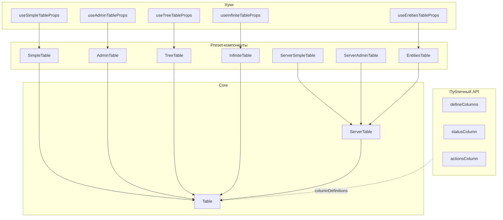

import { Mermaid } from '#docs/components/Mermaid';

# Table

Пакет `@ds/table` предоставляет таблицы поверх `@tanstack/react-table`: полнофункциональные `Table` / `ServerTable` и preset-обёртки с упрощённым API.

## Архитектура пакета



`defineColumns`, `statusColumn` и `actionsColumn` — публичные утилиты: ими собирают `columnDefinitions` для [`Table`](/components/table/table) напрямую. Preset-ы дают тот же результат через упрощённые пропсы (`columns`, `statusColumn`, `rowActions` в `AdminTable`).

`ServerTable` — обёртка над `Table` для серверной пагинации, сортировки и фильтрации.

## Какой сценарий выбрать

### Компоненты

| Сценарий                                         | Компонент                                           |
| ------------------------------------------------ | --------------------------------------------------- |
| Полный контроль над API                          | [`Table`](/components/table/table)                  |
| Серверная пагинация                              | [`ServerTable`](/components/table/server-table)     |
| Серверный список сущностей + queryFn             | [`EntitiesTable`](/components/table/entities-table) |
| Простой список: данные + колонки + пагинация     | [`SimpleTable`](/components/table/simple-table)     |
| Админка: поиск, фильтры, выбор, статус, действия | [`AdminTable`](/components/table/admin-table)       |
| Иерархия (дерево)                                | [`TreeTable`](/components/table/tree-table)         |
| Бесконечная прокрутка                            | [`InfiniteTable`](/components/table/infinite-table) |

### Утилиты

| Сценарий                | Утилита                                             |
| ----------------------- | --------------------------------------------------- |
| Декларативные колонки   | [`defineColumns`](/components/table/define-columns) |
| Колонка статуса         | `statusColumn`                                      |
| Колонка действий строки | `actionsColumn`                                     |

Каждый preset доступен в двух формах: **компонент** (`<SimpleTable />`) и **хук** (`useSimpleTableProps()` + `<Table />`).

Карточный режим (`headlineKey`, `defaultView`, `view`) — сквозная опция всех preset-ов, не отдельный компонент.

## Установка

```bash
pnpm add @ds/table
```

```ts
import { Table, ServerTable, SimpleTable, defineColumns } from '@ds/table';
```

## Смотри также

- [Pagination](/components/pagination) — отдельный компонент пагинации.
- [InfoBlock](/components/info-block) — основа пустых состояний таблицы.
- [Card](/components/card) — самостоятельные карточки вне таблицы.
