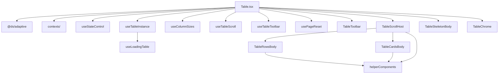

# Table — внутренняя структура

`Table.tsx` — оркестратор: пропсы, хуки, `TableContext.Provider` и сборка layout. Вся остальная логика и JSX разнесены по модулям этой папки и соседним пакетным примитивам.

Публичный API компонента — в [packages/table/docs/table.mdx](../../../docs/table.mdx).

Preset-ы (`AdminTable`, `ServerTable`, `EntitiesTable`, …) и `helperComponents/` — вне этой папки; здесь только core `Table`.

## Архитектура



## Зоны ответственности

| Зона | Модуль | Ответственность |
| ---- | ------ | --------------- |
| Controlled props | `hooks/useStateControl` | uncontrolled/controlled glue для `search`, `sorting`, `pagination`, `rowSelection`, `expanding` |
| State / tanstack | `hooks/useTableInstance` + `buildAllTableColumns` | column defs, pinning, `useReactTable`, bulk selection |
| Loading table | `hooks/useLoadingTable` | skeleton-строки и loading column defs (внутри `useTableInstance`) |
| Column resize | `hooks/useColumnSizes` | CSS-vars ширин колонок, localStorage, sync в tanstack |
| Scroll / sticky | `hooks/useTableScroll` | scroll refs, header scroll sync, toolbar/chrome CSS-vars offset, `scrollOverflow` |
| Toolbar | `hooks/useTableToolbar` + `components/TableToolbar` | persist (`saveTableState`), search, bulk, dataView, sorting/columns slots |
| Column settings | `hooks/useColumnSettings` | видимость колонок, меню настроек, saved state |
| Filters | `hooks/useFilters` | filter-row, состояние фильтров |
| Virtualization | `hooks/useRowVirtualizer`, `hooks/useColumnVirtualizer` | виртуализация строк и колонок |
| Column order | `hooks/useColumnOrderByDrag` + `DndContext` в `Table.tsx` | DnD порядка колонок |
| Page index | `hooks/usePageReset` | сброс `pageIndex`, если страница вне диапазона (client pagination) |
| Adaptive | `@ds/adaptive` + `TABLE_LAYOUT_PRESETS` | `layoutType`, mobile-дефолты `stickyControls`, `fullWidth` |
| Context | `contexts/` (`TableContext`, `CellAutoResizeContext`) | auto-resize ячеек, `fullWidth`, virtualization padding, shared table API для строк/ячеек |
| Table rows | `components/TableRowsBody` | pinned top rows, virtualization, infinite tail, load-more, empty state |
| Cards view | `components/TableCardsBody` | сетка карточек, mobile list, load-more button |
| Loading | `components/TableSkeletonBody` | skeleton table/cards |
| Scroll shell | `components/TableScrollHost` | варианты `Scroll`, sticky header plate, mobile cards container |
| Chrome | `components/TableChrome` | `ControlsChrome` для toolbar и pagination |
| Layout shell | `Table.tsx` + `styles.module.scss` | `.wrapper`, grid/flex, `data-fit-content` при `fullWidth={false}`, провайдеры |
| Утилиты | `utils/` | pinning, column ids, CSS-vars, `getTableColumnsDefinitions`, `saveTableState/*` |
| Примитивы UI | `helperComponents/` | `HeaderRow`, `BodyRow`, `Row` (`data-fit-content` из `TableContext`), ячейки, `TableCard`, `TablePagination`, `TableEmptyState`, `LoadMoreButton`, `ControlsChrome` |

## Дерево файлов

```text
packages/table/src/components/Table/
├── STRUCTURE.md
├── Table.tsx
├── index.ts
├── styles.module.scss              ← layout-стили Table (общий модуль)
├── hooks/
│   ├── useTableInstance.tsx        ← buildAllTableColumns
│   ├── useLoadingTable.tsx
│   ├── loadingTableCells.tsx
│   ├── useStateControl.ts
│   ├── usePageReset.ts
│   ├── useColumnSizes.ts
│   ├── useTableScroll.ts
│   ├── useTableToolbar.ts
│   ├── useColumnSettings/
│   ├── useFilters/
│   ├── useRowVirtualizer.ts
│   ├── useColumnVirtualizer.ts
│   └── useColumnOrderByDrag/
├── components/
│   ├── TableToolbar/
│   ├── TableRowsBody/
│   ├── TableCardsBody/
│   ├── TableSkeletonBody/
│   ├── TableScrollHost/
│   └── TableChrome/
└── utils/
    ├── getTableColumnsDefinitions.ts
    ├── columnSize.ts
    └── saveTableState/             ← persist toolbar (validators, mappers)

packages/table/src/contexts/          ← TableContext, CellAutoResizeContext
packages/table/src/helperComponents/  ← строки, ячейки, карточки, pagination, empty state, chrome
```

## Стили

Все layout-стили таблицы — в едином [`styles.module.scss`](styles.module.scss). Подкомпоненты в `components/` импортируют классы оттуда (`import styles from '../../styles.module.scss'`): родительские селекторы вроде `.wrapper .tableView .table` завязаны на один CSS Modules scope.

При разнесении стилей по подкомпонентам — только `data-*` атрибуты в shell-селекторах, без привязки к class name дочерних модулей.
