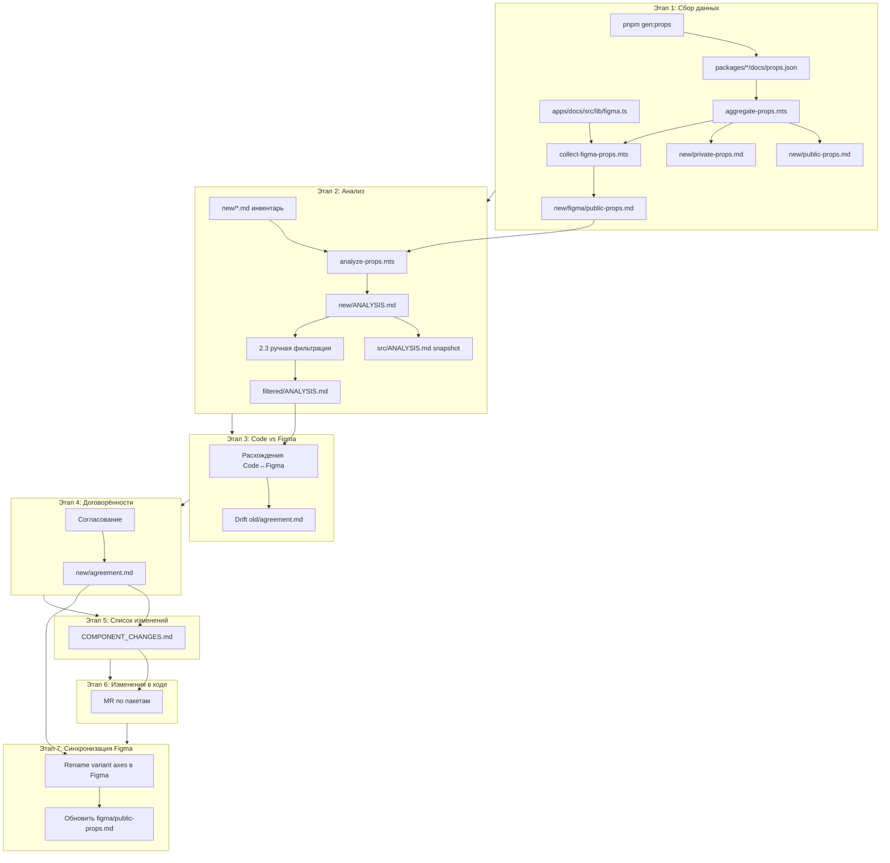

# План рефакторинга единообразия API пропов

## Контекст

**Два источника истины (актуальные):**
- **Code** — TypeScript API из `./packages` ([`scripts/gen-props.mts`](scripts/gen-props.mts) → `docs/props.json`)
- **Figma** — variant properties из Figma-файлов DS ([`apps/docs/src/lib/figma.ts`](apps/docs/src/lib/figma.ts) → node IDs)

**Артефакты сбора (скрипты, корень `new/`):** [`props-refactoring/new/public-props.md`](props-refactoring/new/public-props.md), `private-props.md`, `object-shapes.md`, `prop-boundary-renames.md`, `figma/public-props.md` — **пользователь не просматривает**, только вход для `analyze-props`.

**Анализ — три версии:**
- [`props-refactoring/new/ANALYSIS.md`](props-refactoring/new/ANALYSIS.md) — актуальный вывод `pnpm analyze:props` (перезаписывается скриптом)
- [`props-refactoring/new/src/ANALYSIS.md`](props-refactoring/new/src/ANALYSIS.md) — **снимок для истории** (не редактировать)
- [`props-refactoring/new/filtered/ANALYSIS.md`](props-refactoring/new/filtered/ANALYSIS.md) — **рабочая версия после 2.3**; этапы **3–7** опираются на неё

**Справочно (не baseline для сравнения):**
- [`props-refactoring/old/public-props.md`](props-refactoring/old/public-props.md) — снимок Figma ~2025
- [`props-refactoring/old/ANALYSIS.md`](props-refactoring/old/ANALYSIS.md) — категориальный анализ того снимка
- [`props-refactoring/old/agreement.md`](props-refactoring/old/agreement.md) — договорённости по `appearance` / `view` / `variant` / `role` (проверяем на drift, но не сравниваем с ним Code↔Figma)

**Критерий public/private (согласовано):**
- **Public** — компонент реэкспортирован через цепочку `export *` из [`packages/<pkg>/src/index.ts`](packages/button/src/index.ts)
- **Private** — всё остальное + пакеты `*-private`
- **Figma-сбор** — только **public**-компоненты (internal/private в Figma не представлены или не релевантны)



---

## Этап 1. Сбор данных

### 1.1 Актуализировать props.json (Code)

```bash
pnpm gen:props
```

Убедиться, что все 96+ пакетов с `.tsx`-компонентами имеют свежий [`docs/props.json`](packages/button/docs/props.json).

### 1.2 Отдельный скрипт агрегации Code-пропов

**В рамках текущей задачи** создаём новый standalone-скрипт [`scripts/aggregate-props.mts`](scripts/aggregate-props.mts). [`scripts/gen-props.mts`](scripts/gen-props.mts) **не меняем**.

Границы ответственности:
- `gen-props.mts` — `.tsx` → `packages/*/docs/props.json`
- `aggregate-props.mts` — props.json + export graph → `props-refactoring/new/public-props.md` + `private-props.md`

Запуск: `pnpm aggregate:props`.

Скрипт:
1. Строит **граф экспортов** (TS Program, как в gen-props): `src/index.ts` → barrel → `.tsx`
2. Классифицирует компоненты из props.json: exported → public, остальное → private
3. Форматирует markdown по образцу old/public-props.md (enum values, boolean → `true, false`)
4. Пишет [`props-refactoring/new/public-props.md`](props-refactoring/new/public-props.md) и [`private-props.md`](props-refactoring/new/private-props.md)

### 1.3 Сбор актуальных Figma-пропов (public only)

**Новый подпункт.** Создаём отдельный скрипт [`scripts/collect-figma-props.mts`](scripts/collect-figma-props.mts).

**Выход:** [`props-refactoring/new/figma/public-props.md`](props-refactoring/new/figma/public-props.md)

**Зачем:**
1. Сверить текущую реализацию (Code) с актуальной Figma и учесть расхождения при принятии решений
2. Подготовить baseline для **Этапа 7** (переименование осей в Figma после изменений в коде)

#### Источник node IDs — [`apps/docs/src/lib/figma.ts`](apps/docs/src/lib/figma.ts)

Файл — центральная карта Figma-узлов по имени пакета. Ключевые сущности:

```ts
type FigmaNodeRef = { fileKey: string; fileName: string; nodeId: string }

// Константы файлов:
// SNACK     — Snack-Ui-Kit-variables  (fileKey: aNPU3MHwRJiEwbk5F82zux) — основная DS
// PRODUCT   — Product-UI-Kit          (fileKey: VWNiBRIUmVXIWYlLzMxcs6) — uikit-product-*
// AI_COMPONENTS, INTERFACES_ICONS, HR_PORTAL, LIST_STATES — спец. файлы

export const FIGMA_NODES = {
  button: { ...SNACK, nodeId: '2507-25203' },           // leaf: один узел на пакет
  chips: {
    _: { ...SNACK, nodeId: '28137-1776436' },           // root canvas
    'chip-assist': { ...SNACK, nodeId: '6437-16196' },  // sub-компонент
    // ...
  },
} as const
```

**Хелперы для URL:**
- `figmaNode(pkg, sub?)` — lookup узла по имени пакета и опциональному sub-ключу (kebab-case)
- `figmaDesignUrl(ref)` → `https://www.figma.com/design/<fileKey>/<fileName>?node-id=<id>&m=dev`
- Пример корневой ссылки DS: [Snack-Ui-Kit-variables](https://www.figma.com/design/aNPU3MHwRJiEwbk5F82zux/Snack-Ui-Kit-variables?node-id=3049-26561&p=f&m=dev)

Sub-ключ в `FIGMA_NODES` соответствует kebab-case сегменту story title (см. [figma-integration.md](.claude/rules/figma-integration.md)).

#### Алгоритм collect-figma-props.mts

1. **Импортировать `FIGMA_NODES`** из `apps/docs/src/lib/figma.ts` (или парсить AST — без дублирования данных)

2. **Получить список public-компонентов** — переиспользовать export graph из aggregate-props (общий модуль `scripts/props-refactoring/export-graph.mts`)

3. **Сопоставить public-комponent ↔ Figma-узел:**
   - Single-component пакет (`FIGMA_NODES[pkg]` — leaf) → один узел на весь пакет
   - Multi-component пакет (`{ _: root, 'sub-key': ref }`) → sub-ключ ↔ kebab-case имени public-компонента
   - Пакеты без ключа в `FIGMA_NODES` → пропустить, зафиксировать в appendix «нет Figma-маппинга»
   - Служебные sub-ключи (`canvas`, `private-elements`, `property-matrix`, `examples`) → **не собирать**

4. **Получить variant axes** для каждого узла через **Figma MCP `get_metadata`** (`fileKey` + `nodeId`):
   - Не требует выделения в Figma Desktop (в отличие от `get_design_context`)
   - Из XML-структуры извлекаем `component_set` / variant frames → имена осей и значений
   - Fallback: если узел — canvas/page, искать внутри `component_set` дочерние component sets
   - Правила интерпретации — из [figma-integration.md](.claude/rules/figma-integration.md):
     - Enum-ось (`Size`, `Placement`) → `- Size: s, m, l`
     - Boolean-ось (`Load`, `Disabled`) → `- Load: true, false`
     - Слот-композиция (`Composition`) → фиксируем как есть (разбор при анализе)

5. **Формат выходного файла** (как old/public-props.md — **Figma-native имена осей**):

```markdown
button
- Size: s, m, l
- Composition: labelOnly, iconOnly, iconBefore, iconAfter
- Load: true, false
- Disabled: true, false
<!-- figma: https://www.figma.com/design/aNPU3MHwRJiEwbk5F82zux/...?node-id=2507-25203&m=dev -->
```

6. **Метаданные в шапке файла:** дата, кол-во компонентов, список файлов Figma (SNACK/PRODUCT/…), компоненты без маппинга

Запуск: `pnpm collect:figma-props`

**Rate limiting:** ~80+ узлов — батчинг с паузой; кэш raw metadata в `props-refactoring/new/figma/.cache/` для повторных прогонов.

### 1.4 Валидация сбора

- Code: сверить public-компоненты с выборкой (button, card, tabs, fields)
- Figma: сверить button (`nodeId: 2507-25203`) — оси Size, Load, Disabled совпадают с component set в Figma
- Cross-check: каждый ключ в `figma/public-props.md` имеет соответствие в `public-props.md` (Code)
- Компоненты только в Code / только в Figma — в appendix обоих файлов

### 1.5 Расширение инвентаря (text/content, nested props) — **выполнено**

**→ Детальный план:** [`props_api_refactoring_ed7916fa.plan.md`](props_api_refactoring_ed7916fa.plan.md).

Реализовано: nested flatten, object-shapes, boundary renames, text census appendix, surface tagging.

**Выход (корень `new/`, скрипты):**
- [`props-refactoring/new/public-props.md`](props-refactoring/new/public-props.md)
- [`props-refactoring/new/private-props.md`](props-refactoring/new/private-props.md)
- [`props-refactoring/new/object-shapes.md`](props-refactoring/new/object-shapes.md)
- [`props-refactoring/new/prop-boundary-renames.md`](props-refactoring/new/prop-boundary-renames.md)

Скрипты: `pnpm aggregate:props`, `pnpm extract:object-shapes`, `pnpm extract:prop-renames`.

---

## Этап 2. Сравнительный анализ

**Генерация:** `pnpm analyze:props` → [`props-refactoring/new/ANALYSIS.md`](props-refactoring/new/ANALYSIS.md).

**После прогона:** снимок в [`src/ANALYSIS.md`](props-refactoring/new/src/ANALYSIS.md) (история); копия для правок — [`filtered/ANALYSIS.md`](props-refactoring/new/filtered/ANALYSIS.md).

### 2.1 Внутренний анализ Code (межкомпонентные конфликты) — **выполнено**

**→ Детали:** [`props_api_refactoring_ed7916fa.plan.md`](props_api_refactoring_ed7916fa.plan.md).

Первый прогон: text/content pass, role groups, §6. **Повторный прогон** после изменения инвентаря — перегенерация `new/ANALYSIS.md` + новый snapshot в `src/`.

Категории (как old/ANALYSIS, но из актуального Code):
1. Размеры и геометрия
2. Визуальный стиль (`appearance`, `view`, `variant`)
3. Состояния (`loading`/`isLoading`, `checked`/`selected`)
4. Поведение и режимы
5. Контент и композиция (enum/slot)
6. **Текстовые и контентные данные**
7. Коллбэки / инфраструктурные (исключены)

Приоритеты P0–P3 — без изменений.

### 2.2 Алгоритм analyze-props.mts

**Gate для agreement:** после 2.3. Скрипт читает инвентарь из **корня `new/`** (не `filtered/`):

- `new/public-props.md` (Code)
- `new/figma/public-props.md` (Figma)
- (опционально) `new/private-props.md`, `new/object-shapes.md`, `new/prop-boundary-renames.md`

**Выход скрипта:** `new/ANALYSIS.md`. Решения по P0/P1 для agreement — из **`filtered/ANALYSIS.md`** после ручной фильтрации пользователем.

#### Предварительный matching Code ↔ Figma (обязательный шаг)

Перед diff **нельзя** сравнивать values «как есть» — у Code и Figma разные модели представления одной и той же оси. Нужен слой нормализации и сопоставления имён.

**1. Сопоставление компонентов** (`component matching`):
- Code: `button (Button)` ↔ Figma: `button` (по pkg + FIGMA sub-key / label)
- Multi-component пакеты: `fields (FieldText)` ↔ Figma: `field-text`
- Namespace-комponentы Code (`Tabs.Tab`) ↔ Figma sub-key — фиксировать в таблице mapping; не все пары 1:1

**2. Сопоставление имён осей** (`prop name matching`):
- Нормализация: camelCase ↔ Title Case (`loading` ↔ `Load`, `iconPosition` ↔ `Composition`)
- Seed-словарь из [figma-integration.md](.claude/rules/figma-integration.md): `Load`→`loading`, `Visual style`→`view`, `Size`→`size`, …
- **Имена могут совпадать семантически при разном написании** — валидный match, не ошибка

**3. Нормализация values перед сравнением** (`value matching`):

| Figma (инвентарь) | Code (инвентарь) | Интерпретация |
|-------------------|------------------|---------------|
| `false, true` | `true, false` | boolean-проп — **match по типу**, не по строке |
| `false, true` (VARIANT) | `boolean` | Figma boolean-VARIANT → Code `boolean` — **match** |
| `Off, On` | `true, false` | boolean как enum в Figma — **match с оговоркой** |
| `labelOnly, iconBefore, …` | `icon` + `iconPosition` | слот-композиция → несколько Code-пропов — **не 1:1** |
| `[Text]` | `string` / `label?: string` | text-слот → string-проп — **match по типу** |
| `[Instance Swap]` | `ReactNode` / nested props | slot — match по типу, values не сравниваем |
| `s, m, l` | `s, m, l` | enum — прямое сравнение values |

**4. Ожидаемые ограничения текущего этапа:**

- **Идеального value-matching не будет** для части осей — и это нормально. Цель — расхождения **имён** и **семантики**, а не побайтовое совпадение строк в md.
- Пример: Figma `Load: false, true` + Code `loading: true, false` → ось **сопоставлена**, values **эквивалентны** (boolean), имена **расходятся** (R1).
- Пример: Figma `Composition: …` + Code `icon` + `iconPosition` → **нет 1:1 value diff**, но имена **корректны для своей модели** — фиксируем как `structural mismatch`, не bug.
- Ложные R2 возникают при сравнении без нормализации — скрипт применяет правила **до** классификации расхождений.

**5. Выход matching-слоя** (секция в ANALYSIS или `MATCHING.md`):
- `component | figmaLabel | codeDisplayName | matched/unmatched`
- `figmaAxis | codeProp | matchKind` где `matchKind` ∈ `exact | normalized | structural | unmatched`

#### Два потока анализа (после matching)

**A. Межкомпонентные конфликты (только Code)** — п. 2.1: `loading` vs `isLoading`, …

**B. Code ↔ Figma diff** — вход для Этапа 3:
- Сравниваем **нормализованные** пары осей
- R1–R4 — только после matching-слоя
- Value diff (R2) — для enum-осей с прямым mapping; boolean/slot/text — через `matchKind`, не строковый diff

### 2.3 Ручная фильтрация ANALYSIS.md (пользователь) — **выполнено**

**Gate перед финализацией agreement (этап 4).** Выполняется **в отдельном диалоге/инстансе AI** — не в основном потоке рефакторинга.

**Пользователь просматривает только ANALYSIS.md** — файлы инвентаря (`public-props.md`, `object-shapes.md` и т.д.) **не фильтрует**.

**Вход:** [`props-refactoring/new/ANALYSIS.md`](props-refactoring/new/ANALYSIS.md) (или копия, уже продублированная в [`filtered/ANALYSIS.md`](props-refactoring/new/filtered/ANALYSIS.md))

**Архив (не редактировать):** [`props-refactoring/new/src/ANALYSIS.md`](props-refactoring/new/src/ANALYSIS.md) — снимок прогона для истории

**Действие:** убрать из `filtered/ANALYSIS.md` шум — false-positive boundary renames, irrelevant P1, nested duplicates, component-specific `variant`, infra и т.п.; оставить релевантные naming-конфликты для agreement

**Выход:** [`props-refactoring/new/filtered/ANALYSIS.md`](props-refactoring/new/filtered/ANALYSIS.md) — **source of truth** для этапов **3–7**

**Правила:**
- При перегенерации `pnpm analyze:props` обновляется `new/ANALYSIS.md`; `src/ANALYSIS.md` — новый snapshot; `filtered/ANALYSIS.md` — актуализировать вручную (или заново отфильтровать)
- Инвентарь в корне `new/` пересобирается скриптами независимо от фильтрации
- Code↔Figma diff (2.2 / этап 3) дописывается в `new/ANALYSIS.md` скриптом; пользователь при необходимости переносит релевантное в `filtered/ANALYSIS.md`

---

## Этап 3. Сравнение Code ↔ Figma (актуальное)

**Prerequisite:** 2.3 выполнен, [`filtered/ANALYSIS.md`](props-refactoring/new/filtered/ANALYSIS.md) актуален.

**Не сравниваем** актуальный Code с [`old/public-props.md`](props-refactoring/old/public-props.md). Diff строится скриптом по инвентарю `new/` + `figma/`; релевантные выводы фиксируются в **`filtered/ANALYSIS.md`**.

Раздел в `filtered/ANALYSIS.md`: **«Code ↔ Figma расхождения»**

### 3.1 Per-component diff

**Prerequisite:** matching-слой из п. 2.2 применён. Diff строится по **нормализованным** парам, не по сырому тексту md.

Для каждого public-кomponenta с Figma-маппингом:

| Компонент | Ось (Code) | Ось (Figma) | matchKind | Values (норм.) | Статус |
|-----------|------------|-------------|-----------|----------------|--------|
| button | `loading` | `Load` | normalized | boolean | R1 — имя |
| button | `disabled` | `Disabled` | normalized | boolean | R1 — имя |
| button | `iconPosition` | `Composition` | structural | — | structural — не 1:1 |
| button | `size` | `Size` | exact | s, m, l | OK |

**Типы расхождений:**
- **R1** — разные имена, эквивалентная семантика/тип (`Load` ↔ `loading`, boolean)
- **R2** — одно имя (после matching), разные enum values — только для `matchKind: exact`
- **R3** — ось есть только в Code или только в Figma (`unmatched`)
- **R4** — разная семантика под похожим именем
- **structural** — оси корректны на обеих сторонах, но модели разные (Composition ↔ icon+iconPosition); **не считается ошибкой** на текущем этапе

### 3.2 Аудит old/agreement.md (drift check)

Проверить [`old/agreement.md`](props-refactoring/old/agreement.md) против **актуального Code и Figma** (не против old snapshot):

| Договорённость | Code | Figma | Drift |
|----------------|------|-------|-------|
| `appearance` — цвета | toaster: status-values | `Appearance color`: … | ⚠️ |
| `view` — обводка/тени | button ✓ | `Visual style` ✓ | ✅ |
| `variant` — per component | typography ✓ | — | проверить |

[`old/ANALYSIS.md`](props-refactoring/old/ANALYSIS.md) — **только справочно** (историческая категоризация Figma-имён), не входит в diff.

---

## Этап 4. Принятие решений → agreement.md

**Gate: ваше согласование.**

[`props-refactoring/new/agreement.md`](props-refactoring/new/agreement.md) включает:
- Канонические имена осей (Code — source of truth для API)
- Figma-native имена осей (target для Этапа 7)
- Матрица rename Code: `From → To → Components`
- Матрица rename Figma: `From → To → nodeIds`
- Scope, breaking change, deprecation strategy
- Решения по R1–R4 из **`filtered/ANALYSIS.md`**

---

## Этап 5. Список компонентов для изменений

[`props-refactoring/new/COMPONENT_CHANGES.md`](props-refactoring/new/COMPONENT_CHANGES.md) — **после финализации agreement**.

```markdown
## button (@ds/button)
- [ ] Code: `loading` — уже канон ✓
- [ ] Figma: `Load` → `Loading` (node 2507-25203)

## tree (@ds/tree)
- [ ] Code: `isLoading` → `loading`
- [ ] Code: `selected` → `checked`
- [ ] Figma: `Checked` → sync после Code MR
```

Генерируется скриптом из agreement. Вход для Этапов 6 и 7.

---

## Этап 6. Внесение изменений в код

**Scope:** компоненты из `COMPONENT_CHANGES.md`, секция Code.

Порядок работ:
1. MR по пакетам (можно батчами по P0 → P1 → P2)
2. Для каждого rename: `types.ts` → `constants.ts` → компонент → stories → `__test__` → `docs/props.json` (regen)
3. Breaking changes: deprecation alias + `@deprecated` JSDoc (если решено в agreement), иначе hard rename
4. Прогон: `pnpm gen:props && pnpm aggregate:props && pnpm analyze:props` — обновить инвентарь и `new/ANALYSIS.md`; snapshot → `src/`; при необходимости актуализировать `filtered/ANALYSIS.md`
5. Gate: pre-mr-audit по [component-api-surface.md](.claude/rules/component-api-surface.md)

**Не входит в scope Этапа 6:** изменения Figma (→ Этап 7).

---

## Этап 7. Актуализация Figma

**Scope:** variant property names в Figma по `COMPONENT_CHANGES.md`, секция Figma.

**После** merge изменений Code (Этап 6), когда agreement зафиксировал target-имена для Figma.

### 7.1 Переименование осей в Figma

Для каждого компонента из agreement:
1. Открыть узел через `figmaDesignUrl(figmaNode(pkg, sub))` — URL из [`figma.ts`](apps/docs/src/lib/figma.ts)
2. Переименовать variant axes в component set (`Load` → `Loading`, `Visual style` → `View`, …)
3. При typos в Figma — исправить (см. [figma-integration.md](.claude/rules/figma-integration.md) «Figma-typo-мост»)

**Инструменты:**
- Figma Desktop (ручной rename) — для небольшого числа осей
- Figma MCP `use_figma` — для batch-операций (если доступен write)
- Документировать каждый rename в `COMPONENT_CHANGES.md` (checkbox Figma)

### 7.2 Верификация

1. `pnpm collect:figma-props` — пересобрать [`figma/public-props.md`](props-refactoring/new/figma/public-props.md)
2. Повторный Code↔Figma diff — R1/R2 должны быть закрыты
3. VisualMatrix / Storybook Figma-панель — оси совпадают

### 7.3 Code Connect (опционально)

При наличии mapping — обновить через `add_code_connect_map` (Figma MCP), чтобы Dev Mode показывал канонические prop names.

---

## Технические артефакты

| Файл | Назначение | Меняем? |
|------|------------|---------|
| [`scripts/gen-props.mts`](scripts/gen-props.mts) | `docs/props.json` | **Нет** |
| [`scripts/aggregate-props.mts`](scripts/aggregate-props.mts) | Code → public/private md | **Да** — новый |
| [`scripts/collect-figma-props.mts`](scripts/collect-figma-props.mts) | FIGMA_NODES → figma/public-props.md | **Да** — новый |
| [`scripts/props-refactoring/export-graph.mts`](scripts/props-refactoring/export-graph.mts) | Общий export graph (shared) | **Да** — новый |
| [`scripts/analyze-props.mts`](scripts/analyze-props.mts) | Code↔Figma diff + конфликты | **Да** — новый |
| [`apps/docs/src/lib/figma.ts`](apps/docs/src/lib/figma.ts) | Карта node IDs | **Нет** (только читаем; новые узлы — при появлении пакетов) |

**npm-scripts:**
```bash
pnpm gen:props           # существующий
pnpm aggregate:props     # новый
pnpm collect:figma-props # новый
pnpm analyze:props       # новый
```

**Выходные md-файлы:**

| Путь | Назначение | Редактируем? |
|------|------------|--------------|
| `props-refactoring/new/public-props.md` | Code, public (инвентарь) | Скрипты |
| `props-refactoring/new/private-props.md` | Code, private | Скрипты |
| `props-refactoring/new/object-shapes.md` | Object shapes | Скрипты |
| `props-refactoring/new/prop-boundary-renames.md` | Boundary renames | Скрипты |
| `props-refactoring/new/figma/public-props.md` | Figma, public only | Скрипт / Этап 7 |
| `props-refactoring/new/ANALYSIS.md` | Сырой анализ (2.1–3) | Скрипт |
| `props-refactoring/new/src/ANALYSIS.md` | Snapshot для истории | **Нет** |
| `props-refactoring/new/filtered/ANALYSIS.md` | Рабочий анализ после 2.3 | **Да** — пользователь |
| `props-refactoring/new/agreement.md` | Договорённости | Этап 4 |
| `props-refactoring/new/COMPONENT_CHANGES.md` | Список изменений | Этап 5 |

---

## Оценка объёма

- **Этап 1:** выполнен (1.1–1.5); инвентарь в корне `new/`
- **Этап 2.3:** ручная фильтрация `filtered/ANALYSIS.md` (только ANALYSIS, не инвентарь)
- **Этап 2–3:** конфликты и Code↔Figma diff; решения — из `filtered/ANALYSIS.md`
- **Этап 4:** 1–2 итерации review
- **Этап 5:** автогенерация ~30–50 пакетов
- **Этап 6:** ~30–50 MR-worthy пакетов (Code changes)
- **Этап 7:** ~80 Figma component sets (rename axes)

---

## Риски

1. **Figma MCP rate limits** — кэш metadata, батчинг запросов
2. **Неполный FIGMA_NODES** — не все public-кomponentы имеют sub-ключ; appendix + дозаполнение figma.ts при необходимости
3. **Multi-file Figma** (SNACK + PRODUCT + AI) — скрипт должен брать `fileKey` из каждого `FigmaNodeRef`, не хардкодить SNACK
4. **Canvas vs component_set** — root `_` узлы могут быть page-level; нужен поиск component_set внутри
5. **Этап 7 без REST write API** — batch rename в Figma может потребовать ручной работы или Figma Plugin
6. **Breaking changes в Code** — согласовать порядок: Code first (Этап 6), Figma second (Этап 7)
7. **Разная модель boolean/slot в Figma vs Code** — без matching-слоя diff даёт ложные R2; boolean VARIANT (`false, true`) ≠ string enum в md
8. **filtered/ vs new/ANALYSIS drift** — после перегенерации analyze-props `filtered/ANALYSIS.md` может устареть; нужна ручная resync или повтор 2.3
